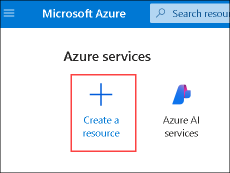
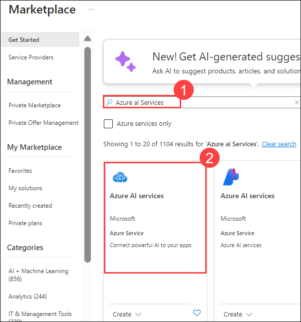
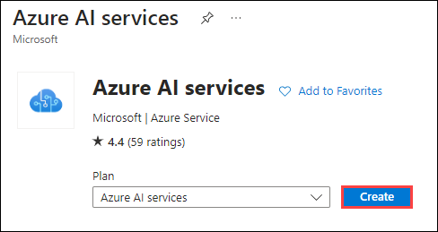
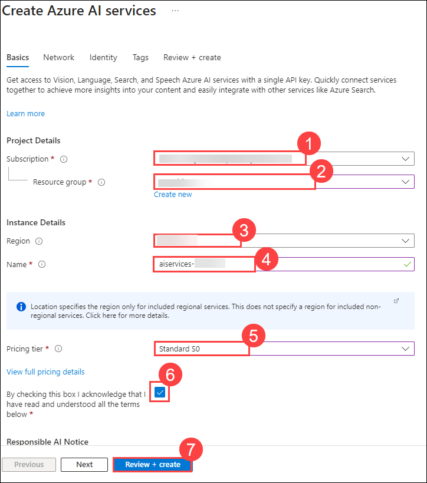
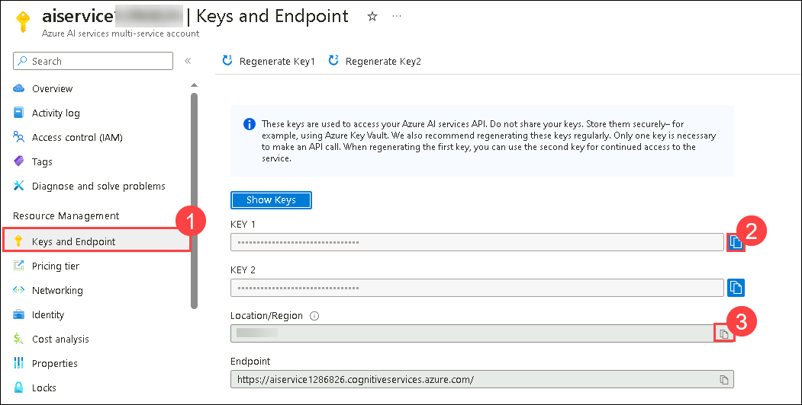

# Exercise 02: Translate Text

## Lab scenario
**Azure AI Translator** is a service that enables you to translate text between languages.

For example, suppose a travel agency wants to examine hotel reviews that have been submitted to the company's web site, standardizing on English as the language that is used for analysis. By using Azure AI Translator, they can determine the language each review is written in, and if it is not already English, translate it from whatever source language it was written in into English.

## Objectives

In this lab, you will complete the following tasks:

+ Task 1: Clone the repo into your Azure Cloud Shell
+ Task 2: Provision an Azure AI Translator resource
+ Task 3: Prepare to use Azure AI Translator
+ Task 4: Detect language
+ Task 5: Translate text

## Estimated timing: 120 minutes

## Architecture diagram

.JPG)

## Task 1: Clone the repo into your Azure Cloud Shell

1. In the [Azure portal](https://portal.azure.com?azure-portal=true), select the **[>_]** (*Cloud Shell*) button at the top of the page to the right of the search box. This opens a Cloud Shell pane at the bottom of the portal. if you are not already in the **Cloud Shell**.

    


1. Make sure the type of shell indicated on the top left of the Cloud Shell pane is switched to *PowerShell*. If it is *Bash*, switch to *PowerShell* by using the drop-down menu.

    

1. Wait for PowerShell to start. You should see the following screen in the Azure portal:  

    

1. Once the terminal starts, run the following commands to download a copy of the repo into your Cloud Shell:

    ```bash
    rm -r azure-ai-eng -f
    git clone https://github.com/MicrosoftLearning/AI-102-AIEngineer azure-ai-eng
    ```

     

1. The files have been downloaded into a folder called **azure-ai-eng**. Let's use the Cloud Shell Code editor to open the appropriate folder by running:

    ```bash
    cd azure-ai-eng/06-translate-text
    ```
1. Open the built-in code editor, and observe the text files in the `text-analysis` folder. Use the following command to open the lab files in the code editor.

    ```bash
    code .
    ```
     

    > **Note**: If you asked for switch to classic shell please click on confirm.     

     > **Note**: If you don't see the built-in code editor, please repeat steps 5 and 6 accordingly.   

## Task 2: Provision an Azure AI Translator resource

1. Open a new tab, and open Azure portal at `https://portal.azure.com`.

1. In the Azure Portal click the **&#65291;Create a resource** button.

     
   
1. In the Marketplace page search for **Azure ai Services (1)** then press Enter and then Select **Azure ai Services (2)**. 
   
   
     
1. On Cognitive Services Page Click on **Create**. 
     
     

1. Create a resource with the following settings and then click on **Review_Create (7)**.

    - **Subscription (1)**: **Use default Subscription (1)**
    - **Resource group (2)**: **Ai-102-<inject key="DeploymentID" enableCopy="false"/> (2)**
    - **Region (3)**: **<inject key="Region" enableCopy="false"/> (3)**
    - **Name (4)**: **aiservices-<inject key="DeploymentID" enableCopy="false"/> (4)**
    - **Pricing tier (5)**: **Standard S0 (5)**
    - By checking this box I acknowledge that I have read and understood all the terms below: **Selected (6)**

             

1. Select **Create**.

   

1. Wait for deployment to complete, and once deployment completed click on **Go to resource**.

   

1. When the resource has been deployed, go to it and view its **Keys and Endpoint (1)** page. You will need one of the **keys** and the **location** in which the service is provisioned from this page in the next procedure.

   >**Note:** Copy the value of **KEY 1 (2)** and **Location (3)**, paste it inside the Notepad, you will use these values in next task.

   

## Task 3: Prepare to use Azure AI Translator

In this exercise, you'll complete a partially implemented client application that uses the Azure AI Translator REST API to translate hotel reviews.

> **Note:** You can choose to use the API from either **C#** or **Python**. In the steps below, perform the actions appropriate for your preferred language.

1. In your Cloud Shell editor, expand the **06-translate-text** folder, and then the **C-Sharp** > **text-translation** or **Python**  > **text-translation** folder depending on your language preference.
1. View the contents of the **text-translation** folder, and note that it contains a file for configuration settings:
    
    - **C#**: appsettings.json
    
    - **Python**: .env

        >**Note:** Open the notepad, where you pasted the values and update the configuration values it contains to include an authentication **key** for your Azure AI Translator resource, and the **location** where it is deployed (<u>not</u> the endpoint). 
    
1. Save your changes by pressing **CTRL + S**.

1. Note that the **text-translation** folder contains a code file for the client application:

    - **C#**: Program.cs
    
    - **Python**: text-translation.py

1. Open the code file and examine the code it contains.

1. In the **Main** function, note that code to load the Azure AI Translator key and region from the configuration file has already been provided. The endpoint for the  service is also specified in your code.

1. In your terminal enter the following commands to point the terminal to the appropriate folder and do a test run:

    **C#**

    ```bash
    cd C-Sharp/text-translation
    ```

    **C#**

    ```bash
    dotnet run
    ```

     

    **Python**

    ```bash
    cd Python/text-translation
    ```

    **Python**

    ```bash
    pip install python-dotenv
    ```
    

    **Python**

    ```bash
    python text-translation.py
    ```
    

1. Observe the output as the code should run without error, displaying the contents of each review text file in the **reviews** folder. The application currently doesn't make use of Azure AI Translator. We'll fix that in the next procedure.

## Task 4: Detect language

Azure AI Translator can automatically detect the source language of text to be translated, but it also enables you to explicitly detect the language in which text is written.

1. In your code file, find the **GetLanguage** function, which currently returns "en" for all text values.
 
    

1. In the **GetLanguage** function, under the comment **Use the Translator detect function**, add the following code to use the Azure AI Translator's REST API to detect the language of the specified text, being careful not to replace the code at the end of the function that returns the language:

    **C#**

    ```csharp
    // Use the Azure AI Translator translate function
    object[] body = new object[] { new { Text = text } };
    var requestBody = JsonConvert.SerializeObject(body);
    using (var client = new HttpClient())
    {
        using (var request = new HttpRequestMessage())
        {
            // Build the request
            string path = "/translate?api-version=3.0&from=" + sourceLanguage + "&to=en";
            request.Method = HttpMethod.Post;
            request.RequestUri = new Uri(translatorEndpoint + path);
            request.Content = new StringContent(requestBody, Encoding.UTF8, "application/json");
            request.Headers.Add("Ocp-Apim-Subscription-Key", cogSvcKey);
            request.Headers.Add("Ocp-Apim-Subscription-Region", cogSvcRegion);

            // Send the request and get response
            HttpResponseMessage response = await client.SendAsync(request).ConfigureAwait(false);
            // Read response as a string
            string responseContent = await response.Content.ReadAsStringAsync();

            // Parse JSON array and get translation
            JArray jsonResponse = JArray.Parse(responseContent);
            translation = (string)jsonResponse[0]["translations"][0]["text"];  
        }
    }

    ```
   

    **Python**

    ```python
    # Use the Azure AI Translator detect function
    path = '/detect'
    url = translator_endpoint + path

    # Build the request
    params = {
        'api-version': '3.0'
    }

    headers = {
    'Ocp-Apim-Subscription-Key': cog_key,
    'Ocp-Apim-Subscription-Region': cog_region,
    'Content-type': 'application/json'
    }

    body = [{
        'text': text
    }]

    # Send the request and get response
    request = requests.post(url, params=params, headers=headers, json=body)
    response = request.json()

    # Parse JSON array and get language
    language = response[0]["language"]

    ```
    
   
    
1. Save your changes by pressing **CTRL+S** and  and enter the following command in the terminal to run the program:

    **C#**

    ```bash
    dotnet run
    ```
   

    **Python**

    ```bash
    python text-translation.py
    ```

   

1. Observe the output, noting that this time the language for each review is identified.

## Task 5: Translate text

Now that your application can determine the language in which reviews are written, you can use Azure AI Translator to translate any non-English reviews into English.

1. In your code file, find the **Translate** function, which currently returns and empty string for all text values.
1. In the **Translate** function, under the comment **Use the Azure AI Translator translate function**, replace the following code to use the Azure AI Translator's REST API to translate the specified text from its source language into English, being careful not to replace the code at the end of the function that returns the translation:

   **C#**

   ```csharp
        // Use the Azure AI Translator translate function
        object[] body = new object[] { new { Text = text } };
        var requestBody = JsonConvert.SerializeObject(body);
        using (var client = new HttpClient())
        {
            using (var request = new HttpRequestMessage())
            {
                // Build the request
                string path = "/translate?api-version=3.0&from=" + sourceLanguage + "&to=en" ;
                request.Method = HttpMethod.Post;
                request.RequestUri = new Uri(translatorEndpoint + path);
                request.Content = new StringContent(requestBody, Encoding.UTF8, "application/json");
                request.Headers.Add("Ocp-Apim-Subscription-Key", cogSvcKey);
                request.Headers.Add("Ocp-Apim-Subscription-Region", cogSvcRegion);

                // Send the request and get response
                HttpResponseMessage response = await client.SendAsync(request).ConfigureAwait(false);
                // Read response as a string
                string responseContent = await response.Content.ReadAsStringAsync();

                // Parse JSON array and get translation
                JArray jsonResponse = JArray.Parse(responseContent);
                translation = (string)jsonResponse[0]["translations"][0]["text"];  
            }
        }
     ```
     

   **Python**
 
   ```python
    # Use the Azure AI Translator translate function
    path = '/translate'
    url = translator_endpoint + path

    # Build the request
    params = {
        'api-version': '3.0',
        'from': source_language,
        'to': ['en']
    }

    headers = {
        'Ocp-Apim-Subscription-Key': cog_key,
        'Ocp-Apim-Subscription-Region': cog_region,
        'Content-type': 'application/json'
    }

    body = [{
        'text': text
    }]

    # Send the request and get response
    request = requests.post(url, params=params, headers=headers, json=body)
    response = request.json()

    # Parse JSON array and get translation
    translation = response[0]["translations"][0]["text"]
   ```

   

1. Save your changes and enter the following command to run the program:

   **C#**

    ```bash
    dotnet run
    ```
    

    **Python**

    ```bash
    python text-translation.py
    ```
   

1. Observe the output, noting that non-English reviews are translated into English.

> **Congratulations** on completing the task! Now, it's time to validate it. Here are the steps:
> - Hit the Validate button for the corresponding task. If you receive a success message, you can proceed to the next task. 
> - If not, carefully read the error message and retry the step, following the instructions in the lab guide.
> - If you need any assistance, please contact us at labs-support@spektrasystems.com. We are available 24/7 to help

<validation step="c6c79fc2-befa-4bec-a292-6982d769df0c" />

### Review
In this lab, you have completed:

+ Cloned the repo into your Azure Cloud Shell
+ Provisioned an Azure AI Translator resource
+ Prepared to use Azure AI Translator
+ Detected language
+ Translated text

## You have successfully completed the lab
