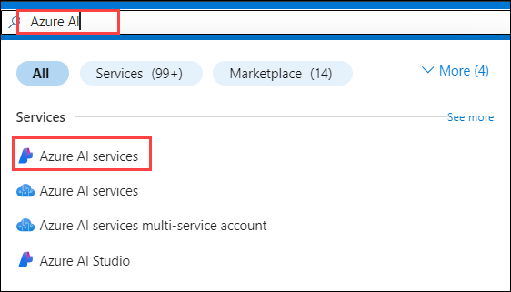
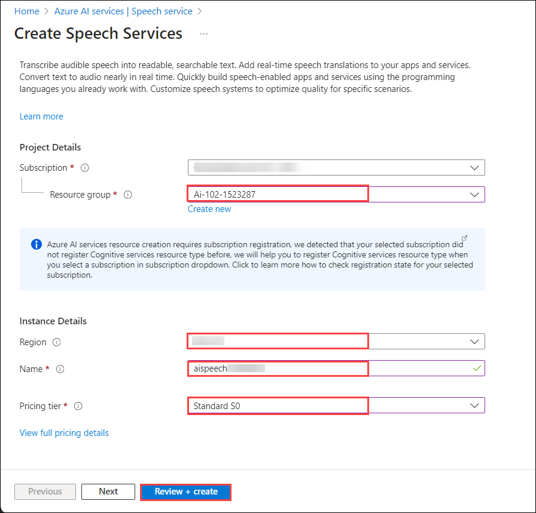

# Exercise 01: Recognize and Synthesize Speech

## Lab scenario
**Azure AI Speech** is a service that provides speech-related functionality, including:

- A *speech-to-text* API that enables you to implement speech recognition (converting audible spoken words into text).
- A *text-to-speech* API that enables you to implement speech synthesis (converting text into audible speech).

In this exercise, you'll use both of these APIs to implement a speaking clock application.

> **Note:** This exercise requires that you are using a computer with speakers/headphones. For the best experience, a microphone is also required. Some hosted virtual environments may be able to capture audio from your local microphone, but if this doesn't work (or you don't have a microphone at all), you can use a provided audio file for speech input. Follow the instructions carefully, as you'll need to choose different options depending on whether you are using a microphone or the audio file.

## Objectives

In this lab, you will complete the following tasks:

+ Task 1: Clone the repo into your Azure Cloud Shell
+ Task 2: Provision an Azure AI Speech resource
+ Task 3: Prepare to use Azure AI speech
+ Task 4: Recognize speech
+ Task 5: Synthesize speech
+ Task 6: Use a different voice
+ Task 7: Use Speech Synthesis Markup Language

## Estimated timing: 120 minutes

## Architecture diagram

.JPG)

## Task 1: Clone the repository for this course

If you have not already cloned **AI-102-AIEngineer** code repository to the environment where you're working on this lab, follow these steps to do so. Otherwise, open the cloned folder in Visual Studio Code.

1. Start Visual Studio Code.

1. Open the New Terminal  and run a **Git: Clone** command to clone the`https://github.com/MicrosoftLearning/AI-102-AIEngineer` repository to a local folder (it doesn't matter which folder).

   
   
1. When the repository has been cloned, open the folder in Visual Studio Code.

   > **Note**: If you are prompted to add required assets to build and debug, select **Not Now**.

1.  Open Explorer, select **File** > **Open Folder** and open **C:\Users\azureuser\AI-102-AIEngineer**.

    >**Note:** On the **Do you trust the authors of the files in this folder?** pop-up, select **Yes, I trust the authors**.

    >**Note:** You may be prompted to complete a 2-minute survey. Go ahead and select **No, thanks**. You may need to do this more than once.

## Task 2: Provision an Azure AI Speech resource

If you don't already have on in your subscription, you'll need to provision a **Azure AI Speech service** resource.

1. Open the Azure portal.

1. Enter **Azure AI** in the search field at the top of the portal. Then select **Azure AI services** in the suggestions dropdown that appears.

   

1. Select **Create** under **Speech service** in the results page.

1. Create a resource using the provided settings. Once completed, click **Review + Create** to validate the configuration, and then click **Create** to deploy the resource.

    - **Subscription**: *Your Azure subscription*
    - **Resource group**: **ai-102-<inject key="DeploymentID" enableCopy="false"/>**
    - **Region**: *Choose any available region*
    - **Name**: **aispeech<inject key="DeploymentID" enableCopy="false"/>**.
    - **Pricing tier**: Standard S0 or S1 based on Availability of the Tier

    

1. Wait for deployment to complete, and then view the deployment details.

1. When the resource has been deployed, go to it and view its **Keys and Endpoint** page. You will need one of the keys and the location in which the service is provisioned from this page in the next procedure.

## Task 3: Prepare to use the Azure AI Speech service

In this exercise, you'll complete a partially implemented client application that uses the Azure AI Speech SDK to recognize and synthesize speech.

1. In Visual Studio Code, in the **Explorer** pane, browse to the **07-speech** folder and expand the **C-Sharp** folder.

1. Right-click the **speaking-clock** folder and open an integrated terminal. Then install the Speech SDK package by running the appropriate command for your language preference:

   **C#**

   ```bash
   dotnet add package Microsoft.CognitiveServices.Speech --version 1.30.0
   ```

1. View the contents of the **speaking-clock** folder, and note that it contains a file for configuration settings:
    
     - **C#**: appsettings.json

1. Open the configuration file and update the configuration values it contains to include an authentication **key** for Azure AI Speech resource, and the **location** where it is deployed. Save your changes.

1. Note that the **speaking-clock** folder contains a code file for the client application:

    - **C#**: Program.cs

1. Open the code file and at the top, under the existing namespace references, find the comment **Import namespaces**. Then, under this comment, add the following language-specific code to import the namespaces you will need to use the Azure AI Speech SDK:

    **C#**

    ```csharp
    // Import namespaces
    using Microsoft.CognitiveServices.Speech;
    using Microsoft.CognitiveServices.Speech.Audio;
    ```

5. In the **Main** function, note that code to load the service key and region from the configuration file has already been provided. You must use these variables to create a **SpeechConfig** for your Azure AI Speech resource. Add the following code under the comment **Configure speech service**:

    **C#**

    ```csharp
    // Configure speech service
    speechConfig = SpeechConfig.FromSubscription(cogSvcKey, cogSvcRegion);
    Console.WriteLine("Ready to use speech service in " + speechConfig.Region);
    
    // Configure voice
    speechConfig.SpeechSynthesisVoiceName = "en-US-AriaNeural";
    ```
6. **Save your changes** and return to the integrated terminal for the **speaking-clock** folder, and enter the following command to run the program:

    **C#**

    ```bash
    dotnet run
    ```

7. If you are using C#, you can ignore any warnings about using the **await** operator in asynchronous methods - we'll fix that later. The code should display the region of the speech service resource the application will use.

## Task 4: Recognize speech

Now that you have a **SpeechConfig** for the speech service in your Azure AI Speech resource, you can use the **Speech-to-text** API to recognize speech and transcribe it to text.

### Task 4.1: If you have a working microphone

1. In the **Main** function for your program, note that the code uses the **TranscribeCommand** function to accept spoken input.
1. In the **TranscribeCommand** function, under the comment **Configure speech recognition**, add the appropriate code below to create a **SpeechRecognizer** client that can be used to recognize and transcribe speech using the default system microphone:

    **C#**

    ```csharp
    // Configure speech recognition
    using AudioConfig audioConfig = AudioConfig.FromDefaultMicrophoneInput();
    using SpeechRecognizer speechRecognizer = new SpeechRecognizer(speechConfig, audioConfig);
    Console.WriteLine("Speak now...");
    ```

1. Now skip ahead to the **Add code to process the transcribed command** section below.

### Task 4.2: Alternatively, use audio input from a file

1. In the terminal window, enter the following command to install a library that you can use to play the audio file:

    **C#**

    ```bash
    dotnet add package System.Windows.Extensions --version 4.6.0 
    ```

1. In the code file for your program, under the existing namespace imports, add the following code to import the library you just installed:

    **C#**

    ```csharp
    using System.Media;
    ````

1. In the **Main** function, note that the code uses the **TranscribeCommand** function to accept spoken input. Then in the **TranscribeCommand** function, under the comment **Configure speech recognition**, add the appropriate code below to create a **SpeechRecognizer** client that can be used to recognize and transcribe speech from an audio file:

    **C#**

    ```csharp
    // Configure speech recognition
    string audioFile = "time.wav";
    SoundPlayer wavPlayer = new SoundPlayer(audioFile);
    wavPlayer.Play();
    using AudioConfig audioConfig = AudioConfig.FromWavFileInput(audioFile);
    using SpeechRecognizer speechRecognizer = new SpeechRecognizer(speechConfig, audioConfig);
    ```

### Task 4.3: Add code to process the transcribed command

1. In the **TranscribeCommand** function, under the comment **Process speech input**, add the following code to listen for spoken input, being careful not to replace the code at the end of the function that returns the command:

    **C#**

    ```csharp
    // Process speech input
    SpeechRecognitionResult speech = await speechRecognizer.RecognizeOnceAsync();
    if (speech.Reason == ResultReason.RecognizedSpeech)
    {
        command = speech.Text;
        Console.WriteLine(command);
    }
    else
    {
        Console.WriteLine(speech.Reason);
        if (speech.Reason == ResultReason.Canceled)
        {
            var cancellation = CancellationDetails.FromResult(speech);
            Console.WriteLine(cancellation.Reason);
            Console.WriteLine(cancellation.ErrorDetails);
        }
    }
    ```

1. **Save your changes** and return to the integrated terminal for the **speaking-clock** folder, and enter the following command to run the program:

    **C#**

    ```bash
    dotnet run
    ```

    >**Note:** You may be prompted to speak the question, but we are using a virtual environment where voice communication from your laptop or desktop to the virtual environment is not supported

1. If using a microphone, speak clearly and say "**what time is it?**". The program should transcribe your spoken input and display the time (based on the local time of the computer where the code is running, which may not be the correct time where you are).

    - The SpeechRecognizer gives you around 5 seconds to speak. If it detects no spoken input, it produces a "No match" result.

    - If the SpeechRecognizer encounters an error, it produces a result of "Cancelled". The code in the application will then display the error message. The most likely cause is an incorrect key or region in the configuration file.

## Task 5: Synthesize speech

Your speaking clock application accepts spoken input, but it doesn't actually speak! Let's fix that by adding code to synthesize speech.

1. In the **Main** function for your program, note that the code uses the **TellTime** function to tell the user the current time.
1. In the **TellTime** function, under the comment **Configure speech synthesis**, add the following code to create a **SpeechSynthesizer** client that can be used to generate spoken output:

    **C#**

    ```csharp
    // Configure speech synthesis
    speechConfig.SpeechSynthesisVoiceName = "en-GB-RyanNeural";
    using SpeechSynthesizer speechSynthesizer = new SpeechSynthesizer(speechConfig);
    ```
    >**Note:** The default audio configuration uses the default system audio device for output, so you don't need to explicitly provide an **AudioConfig**. If you need to     redirect     audio output to a file, you can use an **AudioConfig** with a filepath to do so.

1. In the **TellTime** function, under the comment **Synthesize spoken output**, add the following code to generate spoken output, being careful not to replace the code at the end of the function that prints the response:

    **C#**

    ```csharp
    // Synthesize spoken output
    SpeechSynthesisResult speak = await speechSynthesizer.SpeakTextAsync(responseText);
    if (speak.Reason != ResultReason.SynthesizingAudioCompleted)
    {
        Console.WriteLine(speak.Reason);
    }
    ```

1. **Save your changes** and return to the integrated terminal for the **speaking-clock** folder, and enter the following command to run the program:

    **C#**

    ```bash
    dotnet run
    ```
    
1. When prompted, speak clearly into the microphone and say "**what time is it?**". The program should speak, telling you the time.

## Task 6: Use a different voice

Your speaking clock application uses a default voice, which you can change. The Speech service supports a range of *standard* voices as well as more human-like *neural* voices. You can also create *custom* voices.

> **Note**: For a list of neural and standard voices, see [Language and voice support](/azure/ai-services/speech-service/language-support?tabs=stt#text-to-speech) in the Speech service documentation.

1. In the **TellTime** function, under the comment **Configure speech synthesis**, modify the code as follows to specify an alternative voice before creating the **SpeechSynthesizer** client:

   **C#**

    ```csharp
    // Configure speech synthesis
    speechConfig.SpeechSynthesisVoiceName = "en-GB-LibbyNeural"; // change this
    using SpeechSynthesizer speechSynthesizer = new SpeechSynthesizer(speechConfig);
    ```
    
1. **Save your changes** and return to the integrated terminal for the **speaking-clock** folder, and enter the following command to run the program:

    **C#**

    ```bash
    dotnet run
    ```

1. When prompted, speak clearly into the microphone and say "**what time is it?**". The program should speak in the specified voice, telling you the time.

## Task 7: Use Speech Synthesis Markup Language

Speech Synthesis Markup Language (SSML) enables you to customize the way your speech is synthesized using an XML-based format.

1. In the **TellTime** function, replace all of the current code under the comment **Synthesize spoken output** with the following code (leave the code under the comment **Print the response**):

   **C#**

    ```csharp
    // Synthesize spoken output
    string responseSsml = $@"
        <speak version='1.0' xmlns='http://www.w3.org/2001/10/synthesis' xml:lang='en-US'>
            <voice name='en-GB-LibbyNeural'>
                {responseText}
                <break strength='weak'/>
                Time to end this lab!
            </voice>
        </speak>";
    SpeechSynthesisResult speak = await speechSynthesizer.SpeakSsmlAsync(responseSsml);
    if (speak.Reason != ResultReason.SynthesizingAudioCompleted)
    {
        Console.WriteLine(speak.Reason);
    }
    ```

1. **Save your changes** and return to the integrated terminal for the **speaking-clock** folder, and enter the following command to run the program:

    **C#**

    ```bash
    dotnet run
    ```

1. When prompted, speak clearly into the microphone and say "**what time is it?**". The program should speak in the voice that is specified in the SSML (overriding the voice specified in the SpeechConfig), telling you the time, and then after a pause telling you it's time to end this lab - which it is!

    >**Note:** You may be prompted to speak the question, but we are using a virtual environment where voice communication from your laptop or desktop to the virtual environment is not supported

### Review
In this lab, you have completed:

+ Cloned the repo into your Azure Cloud Shell
+ Provisioned an Azure AI Speech resource
+ Prepared to use the Azure AI Speech service
+ Recognized speech
+ Synthesized speech
+ Used a different voice
+ Used Speech Synthesis Markup Language

## You have successfully completed the lab, proceed with the next exercises.
