# Exercise 02: Create a Language Service Client Application

## Lab scenario

The Conversational Language Understanding feature of the Azure AI Service for Language enables you to define a conversational language model that client apps can use to interpret natural language input from users, predict the users *intent* (what they want to achieve), and identify any *entities* to which the intent should be applied. You can create client applications that consume conversational language understanding models directly through REST interfaces, or by using language-specific software development kits (SDKs).

## Objectives

In this lab, you will complete the following tasks:

+ Task 1: Open the cloned folder in Visual Studio Code
+ Task 2: Create Language service resources
+ Task 3: Import, train, and publish a Conversational language understanding model
+ Task 4: Prepare to use the Language service SDK
+ Task 5: Get a prediction from the Conversational Language model

## Estimated timing: 45 minutes

## Architecture diagram

.JPG)

## Task 1: Open the cloned folder in Visual Studio Code.

1. Start Visual Studio Code (the program icon is pinned to the Desktop).

    

1. Open a file, From the top-left options, Click on **file->Open Folder** and navigate to **C:\LabFiles** choose **AI-102-AIEngineer-stage** folder and select **select folder**

    **Note:** You may be prompted to complete a 2-minute survey. Go ahead and select **No, thanks**. You may need to do this more than once.
    **Note:** In the Do you trust the authors of the files in this folder? prompt, select **Yes, I trust the authors**

1. Wait while additional files are installed to support the C# code projects in the repo.

## Task 2: Create Language service resources

1. Open the Azure portal.

1. Select the **&#65291;Create a resource** button.

      

1. Search for **language service (1)**,press enter and select **language service (2)** from the services.

      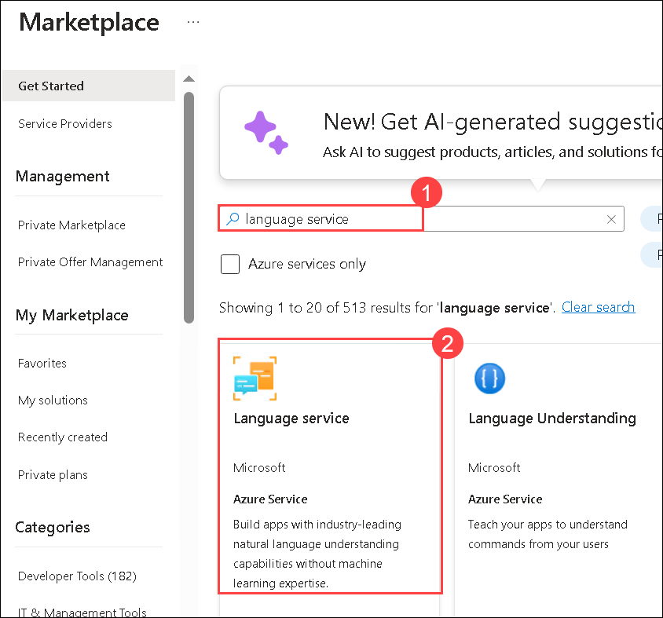

1. Select **Create** button 

      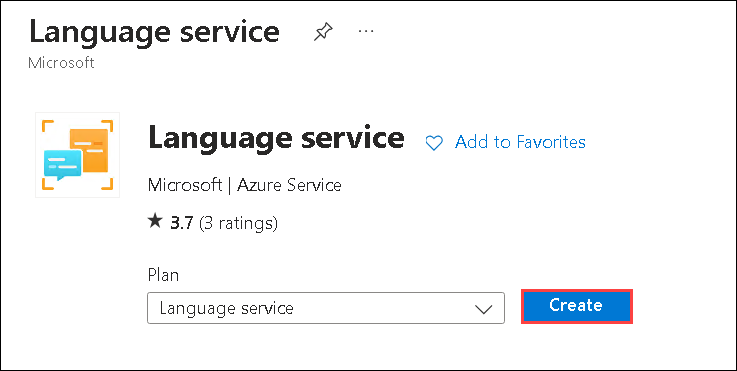

1. Scroll down and select **Continue to create your resource** 

1. Create resource with the following settings and then click on **Review + Create (7)**.

    - **Subscription**: **Keep it as default (1)**
    - **Resource group**: **Ai-102-<inject key="DeploymentID" enableCopy="false" /></inject> (2)**.
    - **Region**: **<inject key="Region" enableCopy="false" /></inject> (3)**
    - **Name**: **languageservice-<inject key="DeploymentID" enableCopy="false" /></inject> (4)**
    - **Pricing tier**: **S (5)**
    - **Responsible AI Notice**: **Select check box to confirm(6)**

      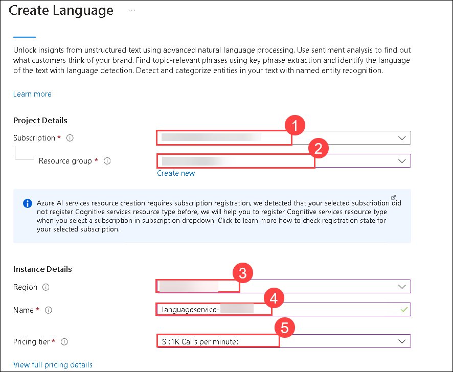

            

1. Click on **Create**.

1. Wait for the resources to be created, click on **Go to resource**.

1. Navigate to the **Keys and Enpoint** under **Resource Management**. Make a copy of **Key1 (2)** and **Endpoint (3)** and then paste it in notepad. You will be using it in the upcoming tasks.

      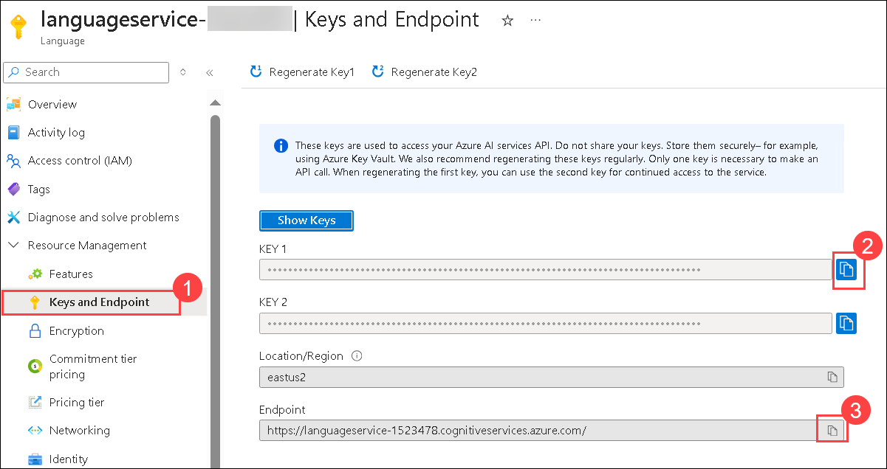

## Task 3: Import, train, and publish a Conversational language understanding model

1. In a new browser tab, open the Language Studio - Preview portal at `https://language.cognitive.azure.com`.

1. Select the user icon from the top right corner, under **Current resource** choose **Select**.

      

1. In the Select an Azure resource tab, keep the Active directory and Azure subscription as default. Under Resource type select **Language (1)** and under resource name select **languageservice-<inject key="DeploymentID" enableCopy="false" /></inject> (2)**.  Click **Done (3)**.

    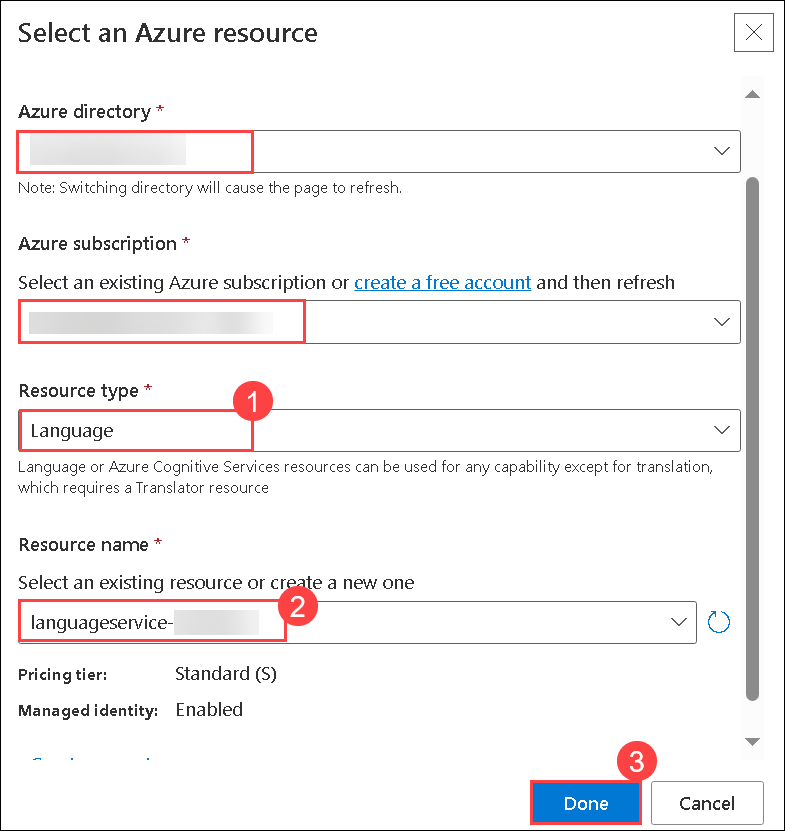
      
1. Sign in using the Microsoft account associated with your Azure subscription. If this is the first time you have signed into the Language Service portal, you may need to grant the app some permissions to access your account details. Then complete the *Welcome* steps by selecting your Azure subscription and the authoring resource you just created.

1. Open the **Conversational Language Understanding** page.

    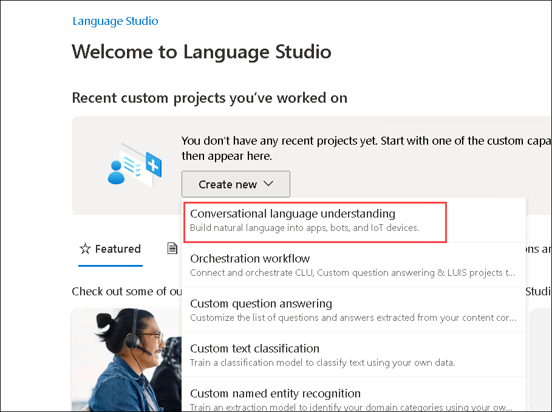

1. Next to **&#65291;Create new project**, select **Import (1)**. Click **Choose File (2)**.

    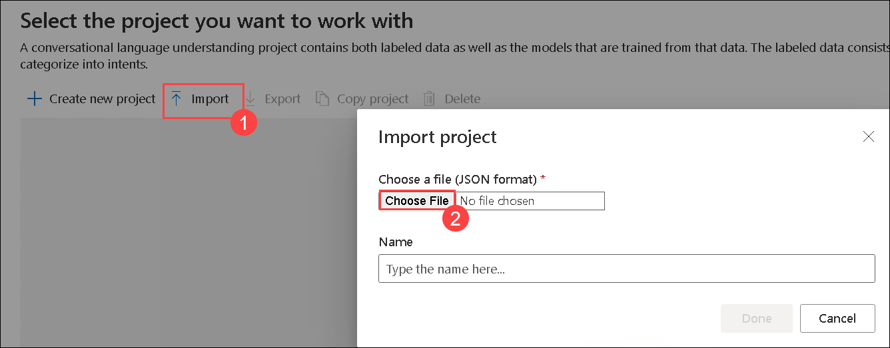
  
1. Select **Clock.json (1)**, click **Open (2)**.

    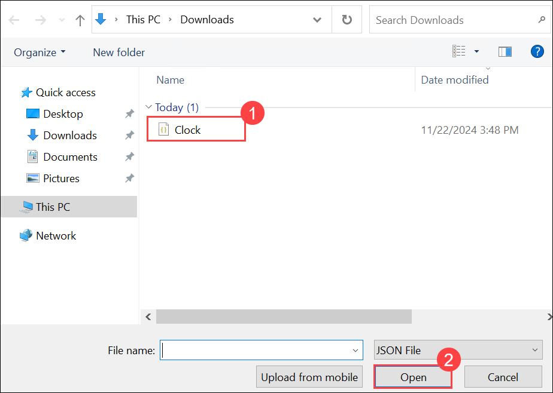

1. Under Name provide **Clock** and then click **Done**.

1. If a panel with tips for creating an effective Language service app is displayed, close it.

1. At the left of the Language Studio portal, select **Training jobs** to train the app. Click **Start a training job**, name the model **Clock** and keep default training mode (Standard) and data splitting. Select **Train**. Training may take several minutes to complete.

    >**Note**: Select **>>** to open the left explorer if not opened. Because the model name **Clock** is hard-coded in the clock-client code (used later in the lab), capitalize and spell the name exactly as described.    

1. Once the training is succeeded, at the left of the Language Studio portal, select **Deploying a model** and use **Add deployment** to create deployment for the **Clock (2)** model that's named **production (1)**. Click on **Deploy (3)**.

    >**Note**: Because the deployment name **production** is hard-coded in the clock-client code (used later in the lab), capitalize and spell the name exactly as described.

     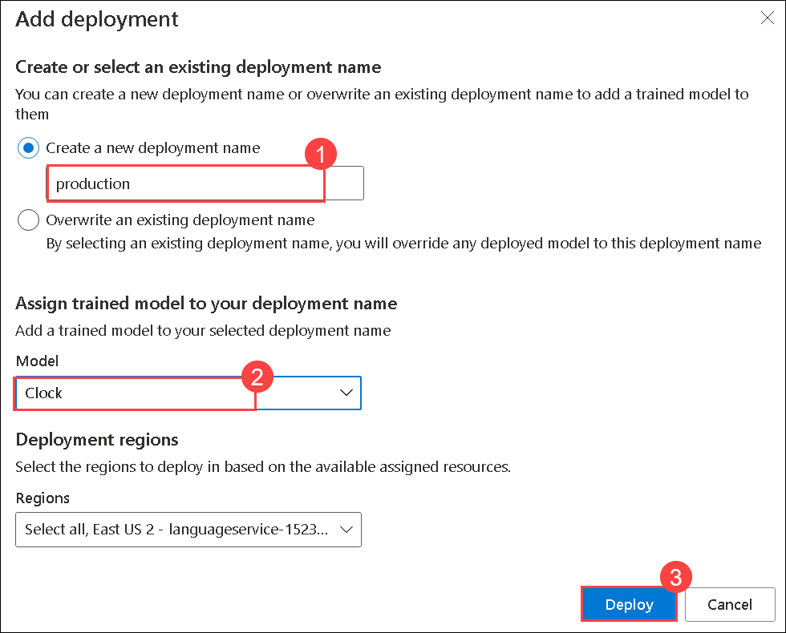     

1. The client applications needs the **Endpoint URL** and **Primary key** to use your deployed model. You had already copied it in the **Task 1**. If not please follow the given steps. After the deployment is complete, to get those parameters, open the Azure portal at [https://portal.azure.com](https://portal.azure.com/?azure-portal=true), and sign in using the Microsoft account associated with your Azure subscription. On the Search bar, search for **Language** and select it to choose the *Azure AI Services|Language service*.

1. Your Language service resource should be listed, select that resource.

1. On the left hand menu, under the *Resource Management* section, select **Keys and Endpoint (1)**. Make a copy of your **KEY 1 (1)** and your **Endpoint (2)**.

    

1. Client applications need information from the prediction URL endpoint and the Language service key to connect to your deployed model and be authenticated.

## Task 4: Prepare to use the Language service SDK

In this exercise, you'll complete a partially implemented client application that uses the Clock model (published Conversational Language Understanding model) to predict intents from user input and respond appropriately.

> **Note**: You can choose to use the SDK for **.NET**. In the steps below, perform the actions appropriate for your preferred language.

1. In Visual Studio Code, in the **Explorer** pane, browse to the **10b-clu-client-(preview)** folder and expand the **C-Sharp** folder depending on your language preference.

1. Right-click the **clock-client (1)** folder and then select **Open in Integrated Terminal (2)**. 

    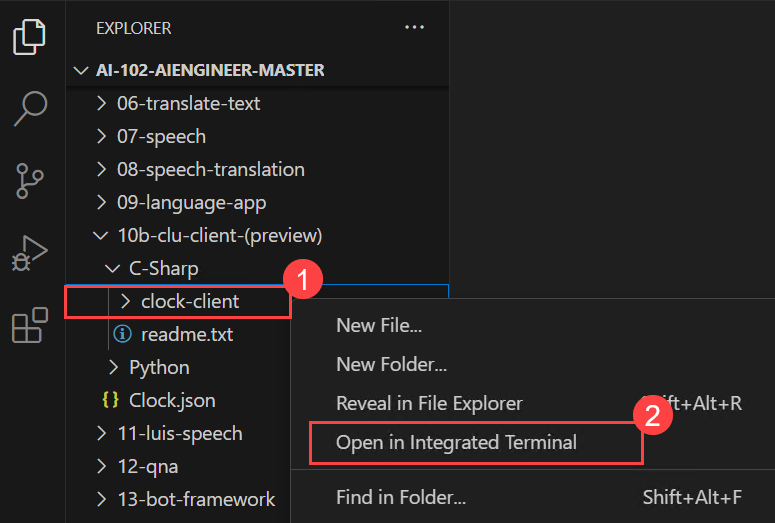

1. Then install the Conversational Language Service SDK package by running the appropriate command for your language preference:

    **C#**

    ```
    dotnet add package Azure.AI.Language.Conversations --version 1.0.0
    dotnet add package Azure.Core
    ```

3. View the contents of the **clock-client** folder, and note that it contains a file for configuration settings:

    - **C#**: appsettings.json

1. Open the configuration file and update the configuration values it contains to include the **Endpoint URL** and the **Primary key** for your Language resource and save the file. You can find the required values in the Azure portal or Language Studio as follows:

    - Azure portal: Open your Language resource. Under **Resource Management**, select **Keys and Endpoint**. Copy the **KEY 1** and **Endpoint** values to your configuration settings file.

      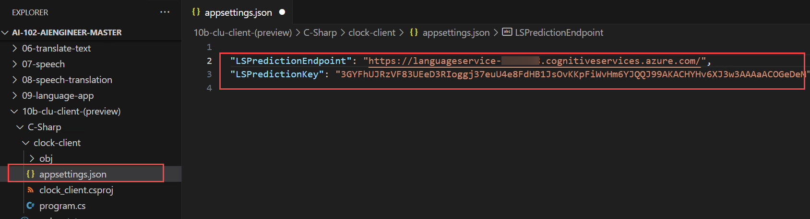   

1. Note that the **clock-client** folder contains a code file for the client application:

    - **C#**: Program.cs

    Open the code file, and at the top, under the existing namespace references, find the comment **Import namespaces**. Then, under this comment, add the following language-specific code to import the namespaces you will need to use the Language service SDK:

    **C#**

    ```C#
    // Import namespaces
    using Azure;
    using Azure.AI.Language.Conversations;
    ```

## Task 5: Get a prediction from the Conversational Language model

Now you're ready to implement code that uses the SDK to get a prediction from your Conversational Language model.

1. In the **Main** function, note that code to load the prediction endpoint and key from the configuration file has already been provided. Then find the comment **Create a client for the Language service model** and add the following code to create a prediction client for your Language Service app:

    **C#**

    ```C#
    // Create a client for the Language service model
    Uri endpoint = new Uri(predictionEndpoint);
    AzureKeyCredential credential = new AzureKeyCredential(predictionKey);

    ConversationAnalysisClient client = new ConversationAnalysisClient(endpoint, credential);
    ```

1. Note that the code in the **Main** function prompts for user input until the user enters "**quit**". Within this loop, find the comment **Call the Language service model to get intent and entities** and add the following code:

    **C#**

    ```C#
    // Call the Language service model to get intent and entities
    var projectName = "Clock";
    var deploymentName = "production";
    var data = new
    {
        analysisInput = new
        {
            conversationItem = new
            {
                text = userText,
                id = "1",
                participantId = "1",
            }
        },
        parameters = new
        {
            projectName,
            deploymentName,
            // Use Utf16CodeUnit for strings in .NET.
            stringIndexType = "Utf16CodeUnit",
        },
        kind = "Conversation",
    };
    // Send request
    Response response = await client.AnalyzeConversationAsync(RequestContent.Create(data));
    dynamic conversationalTaskResult = response.Content.ToDynamicFromJson(JsonPropertyNames.CamelCase);
    dynamic conversationPrediction = conversationalTaskResult.Result.Prediction;   
    var options = new JsonSerializerOptions { WriteIndented = true };
    Console.WriteLine(JsonSerializer.Serialize(conversationalTaskResult, options));
    Console.WriteLine("--------------------\n");
    Console.WriteLine(userText);
    var topIntent = "";
    if (conversationPrediction.Intents[0].ConfidenceScore > 0.5)
    {
        topIntent = conversationPrediction.TopIntent;
    }
    ```

    >**Note:** The call to the Language service model returns a prediction/result, which includes the top (most likely) intent as well as any entities that were detected in the input utterance. Your client application must now use that prediction to determine and perform the appropriate action.

1. Find the comment **Apply the appropriate action**, and add the following code, which checks for intents supported by the application (**GetTime**, **GetDate**, and **GetDay**) and determines if any relevant entities have been detected, before calling an existing function to produce an appropriate response.

    **C#**

    ```C#
    // Apply the appropriate action
    switch (topIntent)
    {
        case "GetTime":
            var location = "local";           
            // Check for a location entity
            foreach (dynamic entity in conversationPrediction.Entities)
            {
                if (entity.Category == "Location")
                {
                    //Console.WriteLine($"Location Confidence: {entity.ConfidenceScore}");
                    location = entity.Text;
                }
            }
            // Get the time for the specified location
            string timeResponse = GetTime(location);
            Console.WriteLine(timeResponse);
            break;
        case "GetDay":
            var date = DateTime.Today.ToShortDateString();            
            // Check for a Date entity
            foreach (dynamic entity in conversationPrediction.Entities)
            {
                if (entity.Category == "Date")
                {
                    //Console.WriteLine($"Location Confidence: {entity.ConfidenceScore}");
                    date = entity.Text;
                }
            }            
            // Get the day for the specified date
            string dayResponse = GetDay(date);
            Console.WriteLine(dayResponse);
            break;
        case "GetDate":
            var day = DateTime.Today.DayOfWeek.ToString();
            // Check for entities            
            // Check for a Weekday entity
            foreach (dynamic entity in conversationPrediction.Entities)
            {
                if (entity.Category == "Weekday")
                {
                    //Console.WriteLine($"Location Confidence: {entity.ConfidenceScore}");
                    day = entity.Text;
                }
            }          
            // Get the date for the specified day
            string dateResponse = GetDate(day);
            Console.WriteLine(dateResponse);
            break;
        default:
            // Some other intent (for example, "None") was predicted
            Console.WriteLine("Try asking me for the time, the day, or the date.");
            break;
    }
    ```

1. Save your changes and return to the integrated terminal for the **clock-client** folder, and enter the following command to run the program:

    **C#**

    ```
    dotnet run
    ```

1. When prompted, enter utterances to test the application. For example, try:

    *Hello*
    
    *What time is it?*

    *What's the time in London?*

    *What's the date?*

    *What date is Sunday?*

    *What day is it?*

    *What day is 01/01/2025?*

    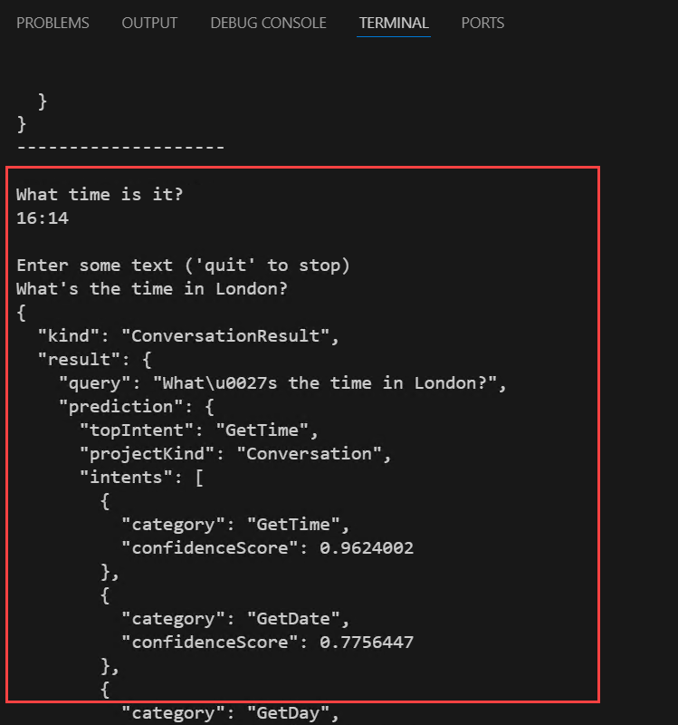    

    > **Note**: The logic in the application is deliberately simple, and has a number of limitations. For example, when getting the time, only a restricted set of cities is supported and daylight savings time is ignored. The goal is to see an example of a typical pattern for using Language Service in which your application must:
    >
    >   1. Connect to a prediction endpoint.
    >   2. Submit an utterance to get a prediction.
    >   3. Implement logic to respond appropriately to the predicted intent and entities.

1. When you have finished testing, enter **quit**.

> **Congratulations** on completing the task! Now, it's time to validate it. Here are the steps:
> - Hit the Validate button for the corresponding task. If you receive a success message, you can proceed to the next task. 
> - If not, carefully read the error message and retry the step, following the instructions in the lab guide.
> - If you need any assistance, please contact us at labs-support@spektrasystems.com. We are available 24/7 to help

<validation step="c04b552b-faf9-49fc-81fb-0c49393a3afa" />    


### Review
In this lab, you have completed:

+ Opened the cloned folder in Visual Studio Code
+ Created Language service resources
+ Imported, trained, and published a Conversational language understanding model
+ Prepared to use the Language service SDK
+ Got a prediction from the Conversational Language model

## You have successfully completed the lab.
