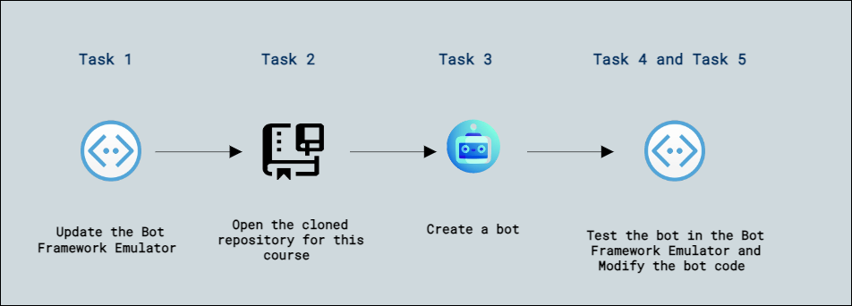
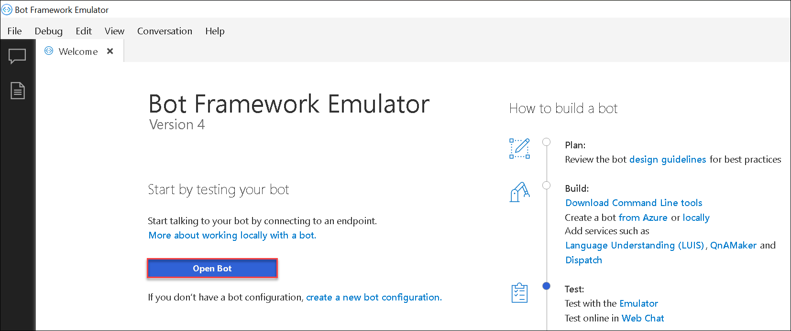
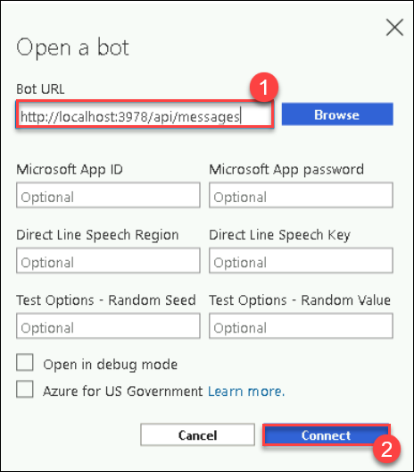
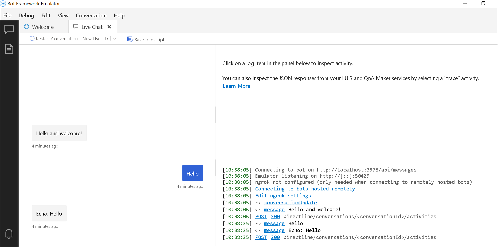

# Exercise 1: Create a Bot with the Bot Framework SDK

## Lab scenario

*Bots* are software agents that can participate in conversational dialogs with human users. The Microsoft Bot Framework provides a comprehensive platform for building bots that can be delivered as cloud services through the Azure Bot Service.

In this exercise, you'll use the Microsoft Bot Framework SDK to create and deploy a bot.

## Objectives

In this lab, you will complete the following tasks:

+ Task 1: Update the Bot Framework Emulator
+ Task 2: Open the cloned repository for this course
+ Task 3: Create a bot
+ Task 4: Test the bot in the Bot Framework Emulator
+ Task 5: Modify the bot code

## Estimated timing: 45 minutes

## Architecture diagram



## Task 1: Update the Bot Framework Emulator

You're going to use the Bot Framework SDK to create your bot, and the Bot Framework Emulator to test it. The Bot Framework Emulator is updated regularly, so let's make sure you have the latest version installed.

> **Note**: Updates may include changes to the user interface that affect the instructions in this exercise.

1. Open an edge browser, copy and paste this link, `https://github.com/microsoft/BotFramework-Emulator/releases/download/v4.15.1/BotFramework-Emulator-4.15.1-windows-setup.exe`, download the **Bot Framework Emulator**.

1. Start the **Bot Framework Emulator**, and if you are prompted to install an update, do so for the currently logged in user. If you are not prompted automatically, use the **Check for update** option on the **Help** menu to check for updates.

    >**Note:** If **Help us improve?** pop-ups, select **Not now**.
    
1. After installing any available update, close the Bot Framework Emulator until you need it again later.

## Task 2: Open the cloned repository for this course

1. In the Lab-VM, double click on the **Visual Studio Code**.

1. Select the **Explorer**, select **Open Folder** in Visual Studio Code. Open **C:\AllFiles** and select folder **AI-102-AIEngineer-stage**.

    >**Note:** On the **Do you trust the authors of the files in this folder?** pop-up, select **Yes, I trust the authors**.

1. Wait while additional files are installed to support the C# code projects in the repo.

    > **Note**: If you are prompted to add required assets to build and debug, select **Not Now**.


## Task 3: Create a bot

You can use the Bot Framework SDK to create a bot based on a template, and then customize the code to meet your specific requirements.

1. In Visual Studio Code, in the **Explorer** pane, browse to the **13-bot-framework** folder and expand the **C-Sharp** folder.

1. Right-click the folder for your **C-Sharp** language and open an integrated terminal.

1. In the terminal, run the following commands to install the bot templates and packages you need:

    ```
    dotnet new -i Microsoft.Bot.Framework.CSharp.EchoBot
    dotnet new -i Microsoft.Bot.Framework.CSharp.CoreBot
    dotnet new -i Microsoft.Bot.Framework.CSharp.EmptyBot
    ```

1. After the templates and packages have been installed, run the following command to create a bot based on the *EchoBot* template:

    ```
    dotnet new echobot -n TimeBot
    ```

1. In the terminal pane, enter the following commands to change the current directory to the **TimeBot** folder list the code files that have been generated for your bot:

    ```
    cd TimeBot
    dir
    ```

## Task 4: Test the bot in the Bot Framework Emulator

You've created a bot based on the *EchoBot* template. Now you can run it locally and test it by using the Bot Framework Emulator (which should be installed on your system).

1. In the terminal pane, ensure that the current directory is the **TimeBot** folder containing your bot code files, and then enter the following command to start your bot running locally.
    
    ```
    dotnet run
    ```

    >**Note:** When the bot starts, note the endpoint at which it is running is shown. This should be similar to  **http://localhost:3978**.

2. Start the **Bot Framework Emulator**, and select **open bot** by specifying the endpoint with the **`http://localhost:3978/api/messages` (1)** path appended, and select **Connect (2)**:

     
    
     

3. After the conversation is opened in a **Live chat** pane, wait for the message *Hello and welcome!*.

4. Enter a message such as *Hello* and view the response from the bot, which should echo back the message you entered.

    

5. Close the Bot Framework Emulator and return to Visual Studio Code, then in the terminal window, enter **CTRL+C** to stop the bot.

## Task 5: Modify the bot code

You've created a bot that echoes the user's input back to them. It's not particularly useful, but serves to illustrate the basic flow of a conversational dialog. A conversation with a bot consists of a sequence of *activities*, in which text, graphics, or user interface *cards* are used to exchange information. The bot begins the conversation with a greeting, which is the result of a *conversation update* activity that is triggered when a user initializes a chat session with the bot. Then the conversation consists of a sequence of further activities in which the user and bot take it in turns to send *messages*.

1. In Visual Studio Code, open the following code file for your bot:
    
    - **C-Sharp**: TimeBot/Bots/EchoBot.cs

        >**Note:** The code in this file consists of *activity handler* functions; one for the *Member Added* conversation update activity (when someone joins the chat session) and another for the *Message* activity (when a message is received). The conversation is based on the concept of *turns*, in which each turn represents an interaction in which the bot receives, processes, and responds to an activity. The *turn context* is used to track information about the activity being processed in the current turn.

2. At the top of the code file, add the following namespace import statement:

    ```C#
    using System;
    ```

3. Modify the activity handler function for the *Message* activity to match the following code:

    ```C#
    protected override async Task OnMessageActivityAsync(ITurnContext<IMessageActivity> turnContext, CancellationToken cancellationToken)
    {
        string inputMessage = turnContext.Activity.Text;
        string responseMessage = "Ask me what the time is.";
        if (inputMessage.ToLower().StartsWith("what") && inputMessage.ToLower().Contains("time"))
        {
            var now = DateTime.Now;
            responseMessage = "The time is " + now.Hour.ToString() + ":" + now.Minute.ToString("D2");
        }
        await turnContext.SendActivityAsync(MessageFactory.Text(responseMessage, responseMessage), cancellationToken);
    }
    ```

4. The code looks similar to this:

    ```C#
    // Generated with EchoBot .NET Template version v4.22.0
    using System;
    using System.Collections.Generic;
    using System.Threading;
    using System.Threading.Tasks;
    using Microsoft.Bot.Builder;
    using Microsoft.Bot.Schema;

    namespace EchoBot.Bots
    {
        public class EchoBot : ActivityHandler
        {
            protected override async Task OnMessageActivityAsync(ITurnContext<IMessageActivity> turnContext, CancellationToken cancellationToken)
            {
                string inputMessage = turnContext.Activity.Text;
                string responseMessage = "Ask me what the time is.";
                if (inputMessage.ToLower().StartsWith("what") && inputMessage.ToLower().Contains("time"))
                {
                    var now = DateTime.Now;
                    responseMessage = "The time is " + now.Hour.ToString() + ":" + now.Minute.ToString("D2");
                }
                await turnContext.SendActivityAsync(MessageFactory.Text(responseMessage, responseMessage), cancellationToken);
            }
        }
    }
    ```


5. Save your changes, and then in the terminal pane, ensure that the current directory is the **TimeBot** folder containing your bot code files, and then enter the following command to start your bot running locally.

    ```
    dotnet run
    ```

    >**Note:** As before, when the bot starts, note the endpoint at which it is running is shown.

6. Start the Bot Framework Emulator, and open your bot by specifying the endpoint with the **`http://localhost:3978/api/messages` (1)** path appended, and select **Connect (2)**.

    
    
    

7. After the conversation is opened in a **Live chat** pane, enter a message such as **Hello** and view the response from the bot, which should be **Ask me what the time is**.

8. Enter **What is the time?** and view the response.

    >**Note:** The bot now responds to the query "What is the time?" by displaying the local time where the bot is running. For any other query, it prompts the user to ask it what the time is. This is a very limited bot, which could be improved through integration with the Language Understanding service and additional custom code, but it serves as a working example of how you can build a solution with the Bot Framework SDK by extending a bot created from a template.

9. Close the Bot Framework Emulator and return to Visual Studio Code, then in the terminal window, enter **CTRL+C** to stop the bot.

### Review
In this lab, you have completed:

+ Updated the Bot Framework Emulator
+ Opened the cloned repository for this course
+ Created a bot
+ Tested the bot in the Bot Framework Emulator
+ Modified the bot code

## You have successfully completed the lab, proceed with the next exercises.
