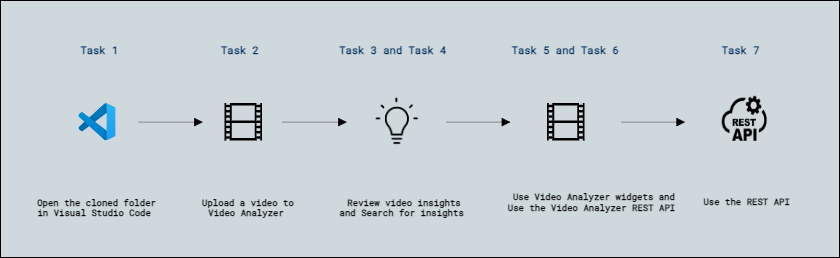
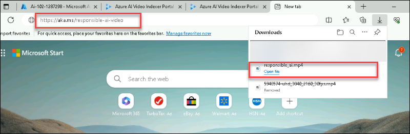
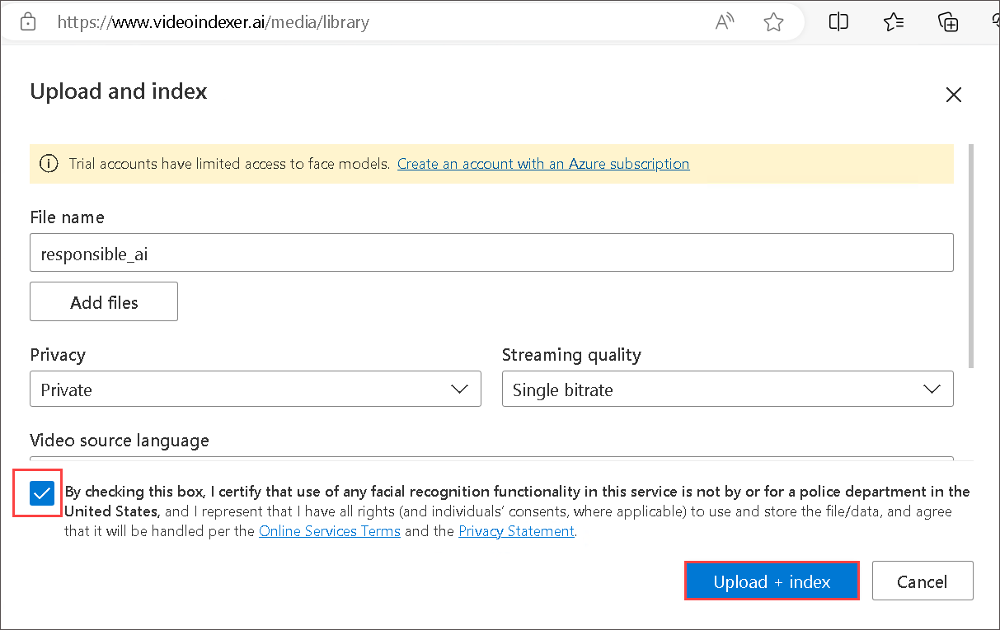
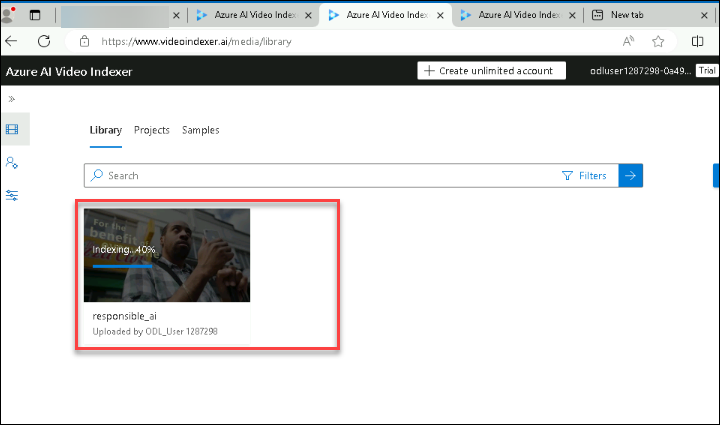
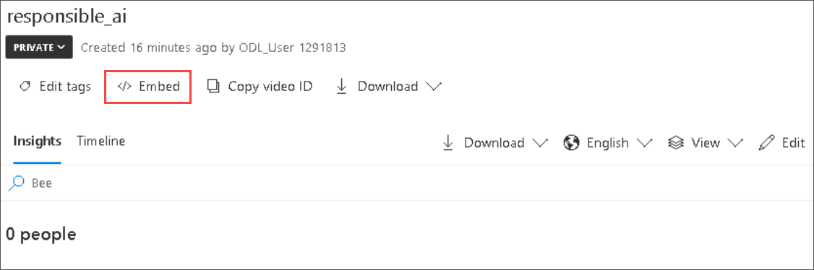
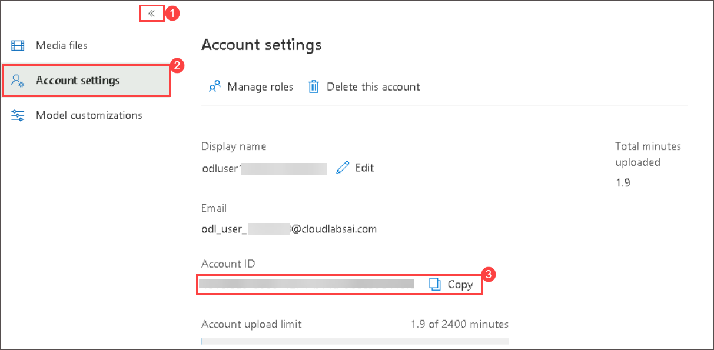
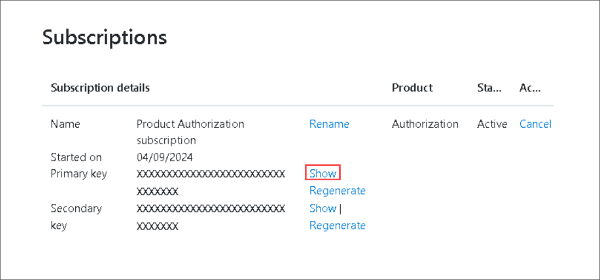

# Exercise 2 : Analyze Video with Video Analyzer

## Lab scenario

A large proportion of the data created and consumed today is in the format of video. **Azure AI Video Indexer** is an AI-powered service that you can use to index videos and extract insights from them.

> **Note**: From June 21st 2022, capabilities of Azure AI services that return personally identifiable information are restricted to customers who have been granted [limited access](https://docs.microsoft.com/azure/cognitive-services/cognitive-services-limited-access). Without getting limited access approval, recognizing people and celebrities with Video Analyzer for this lab is not available. For more details about the changes Microsoft has made, and why - see [Responsible AI investments and safeguards for facial recognition](https://azure.microsoft.com/blog/responsible-ai-investments-and-safeguards-for-facial-recognition/).

## Objectives

In this lab, you will complete the following tasks:

+ Task 1: Open the cloned folder in Visual Studio Code
+ Task 2: Upload a video to Video Analyzer
+ Task 3: Review video insights
+ Task 4: Search for insights
+ Task 5: Use Video Analyzer widgets
+ Task 6: Use the Video Analyzer REST API
+ Task 6.1 : Get your API details
+ Task 7: Use the REST API

## Estimated timing: 90 minutes

## Architecture diagram

## Task 1: Open the cloned folder in Visual Studio Code

1.  Start Visual Studio Code (the program icon is pinned to the bottom taskbar).

     

2.  Open a file, From the top-left options, Click on **file->Open Folder** and navigate to **C:\LabFiles\AI-102-AIEngineer-master**.

## Task 2: Upload a video to Video Analyzer

First, you'll need to sign into the Video Analyzer portal and upload a video.

> **Tip**: If the Video Analyzer page is slow to load in the hosted lab environment, use your locally installed browser. You can switch back to the hosted VM for the later tasks.

1. In your browser, open the Video Analyzer portal at `https://www.videoindexer.ai`.

2. When Choose an account to continue: prompted select **Microsoft Entra ID (formerly Azure AD)** and sign-in with following credentials.

    - **Email/Username:** <inject key="AzureAdUserEmail"></inject>

    - **Password:** <inject key="AzureAdUserPassword"></inject>

4. Download the video by browsing the url in new tab **https://aka.ms/responsible-ai-video**.

    
   
5. In Video Analyzer, select the **Upload** option. Then select the option to **Browse for files** and Select the **Video downloaded** in earlier step and click on **Open**. click on **review+upload**.  select the checkbox to verify compliance with Microsoft's policies for facial recognition, and Click on **Upload + Index**. do not close the upload and index page unless it shows 100% completed, it will cause interruption in the index of video.
       
    

6. After the file has uploaded, wait a few minutes while Video Analyzer automatically indexes it. Dublicate the Tab and View the Index Status

    

    > **Note**: In this exercise, we're using this video to explore Video Analyzer functionality; but you should take the time to watch it in full when you've finished the exercise as it contains useful information and guidance for developing AI-enabled applications responsibly! 

## Task 3: Review video insights

The indexing process extracts insights from the video, which you can view in the portal.

1. In the Video Analyzer portal, when the video is indexed, Click middle of the video to play it. You'll see the video player alongside a pane that shows insights extracted from the video.

    

2. As the video plays, select the **Timeline** tab to view a transcript of the video audio.

    

3. At the top right of the portal, select the **View** symbol (which looks similar to &#128455;), and in the list of insights, in addition to **Transcript**, select **OCR** and **Speakers**.

    

4. Observe that the **Timeline** pane now includes:
    - Transcript of audio narration.
    - Text visible in the video.
    - Indications of speakers who appear in the video. Some well-known people are  automatically recognized by name, others are indicated by number (for example *Speaker #1*).
5. Switch back to the **Insights** pane and view the insights show there. They include:
    - Individual people who appear in the video.
    - Topics discussed in the video.
    - Labels for objects that appear in the video.
    - Named entities, such as people and brands that appear in the video.
    - Key scenes.
6. With the **Insights** pane visible, select the **View** symbol again, and in the list of insights, add **Keywords** and **Sentiments** to the pane.

    The insights found can help you determine the main themes in the video. For example, the **topics** for this video show that it is clearly about technology, social responsibility, and ethics.

## Task 4: Search for insights

You can use Video Analyzer to search the video for insights.

1. In the **Insights** pane, in the **Search** box, enter *Bee*. You may need to scroll down in the Insights pane to see results for all types of insight.
2. Observe that one matching *label* is found, with its location in the video indicated beneath.
3. Select the beginning of the section where the presence of a bee is indicated, and view the video at that point (you may need to pause the video and select carefully - the bee only appears briefly!)
4. Clear the **Search** box to show all insights for the video.

    

## Task 5: Use Video Analyzer widgets

The Video Analyzer portal is a useful interface to manage video indexing projects. However, there may be occasions when you want to make the video and its insights available to people who don't have access to your Video Analyzer account. Video Analyzer provides widgets that you can embed in a web page for this purpose.

1. In Visual Studio Code, in the **16-video-indexer** folder, open **analyze-video.html**. This is a basic HTML page to which you will add the Video Analyzer **Player** and **Insights** widgets. Note the reference to the **vb.widgets.mediator.js** script in the header - this script enables multiple Video Analyzer widgets on the page to interact with one another.

2. In the Video Analyzer portal, return to the **Media files** page and open your **Responsible AI** video.

3. Under the video player, select **&lt;/&gt; Embed** to view the HTML iframe code to embed the widgets.
     

4. In the **Share and Embed** dialog box, select the **Player** widget, set the video size to 560 x 315,  and then copy the embed code to the clipboard.

5. In Visual Studio Code, in the **analyze-video.html** file, paste the copied code under the comment **&lt;-- Player widget goes here -- &gt;**.

6. Back in the **Share and Embed** dialog box, select the **Insights** widget and then copy the embed code to the clipboard. Then close the **Share and Embed** dialog box, switch back to Visual Studio Code, and paste the copied code under the comment **&lt;-- Insights widget goes here -- &gt;**.

7. Save the file. Then in the **Explorer** pane, right-click **analyze-video.html** and select **Reveal in File Explorer**.

8. In File Explorer, open **analyze-video.html** in your browser to see the web page.

9. Experiment with the widgets, using the **Insights** widget to search for insights and jump to them in the video.

    

## Task 6: Use the Video Analyzer REST API

Video Analyzer provides a REST API that you can use to upload and manage videos in your account.

## Task 6.1 : Get your API details

To use the Video Analyzer API, you need some information to authenticate requests:

1. In the Video Analyzer portal, expand the menu (>>) on the left side and select the **Account settings** page. Note the **Account ID** on this page - you will need it later.

    

2. Open a new browser tab and go to the Video Analyzer developer portal at `https://api-portal.videoindexer.ai`, signing in using the credentials for your Video Analyzer account.

    - **Email/Username:** <inject key="AzureAdUserEmail"></inject>

    - **Password:** <inject key="AzureAdUserPassword"></inject>

3. On the **Profile** page, view the **Subscriptions** associated with your profile.
4. On the page with your subscription(s), observe that you have been assigned two keys (primary and secondary) for each subscription. Then select **Show** for any of the keys to see it and copy the Keys You will need this shortly.

    

    .png)

## Task 7: Use the REST API

Now that you have the account ID and an API key, you can use the REST API to work with videos in your account. In this procedure, you'll use a PowerShell script to make REST calls; but the same principles apply with HTTP utilities such as cURL or Postman, or any programming language capable of sending and receiving JSON over HTTP.

All interactions with the Video Analyzer REST API follow the same pattern:

- An initial request to the **AccessToken** method with the API key in the header is used to obtain an access token.
- Subsequent requests use the access token to authenticate when calling REST methods to work with videos.

1. In Visual Studio Code, in the **16-video-indexer** folder, open **get-videos.ps1**.
2. In the PowerShell script, replace the **YOUR_ACCOUNT_ID** and **YOUR_API_KEY** placeholders with the account ID and API key values you identified previously.
3. Observe that the *location* for a free account is "trial". If you have created an unrestricted Video Analyzer account (with an associated Azure resource), you can change this to the location where your Azure resource is provisioned **<inject key="Region" enableCopy="false"/>**.
4. Review the code in the script, noting that invokes two REST methods: one to get an access token, and another to list the videos in your account.
5. Save your changes, and then right click on **16-video-indexer**, click on **open in integrated terminal** and run the script using **.\get-videos.ps1**.
6. View the JSON response from the REST service, which should contain details of the **Responsible AI** video you indexed previously.

     > **Congratulations** on completing the task! Now, it's time to validate it. Here are the steps:
     > - Navigate to the Lab Validation Page, from the upper right corner in the lab guide section.
     > - Hit the Validate button for the corresponding task. If you receive a success message, you can proceed to the next task. 
     > - If not, carefully read the error message and retry the step, following the instructions in the lab guide.
     > - If you need any assistance, please contact us at labs-support@spektrasystems.com. We are available 24/7 to help you out. 

### Review
In this lab, you have completed:

+  Opened the cloned folder in Visual Studio Code
+  Uploaded a video to Video Analyzer
+  Reviewed video insights
+  Searched for insights
+  Used Video Analyzer widgets
+  Used the Video Analyzer REST API
+  Got your API details
+  Used the REST API

## You have successfully completed the lab
