# Exercise 02: Create a Custom Skill for Azure AI Search

## Lab scenario
Azure AI Search uses an enrichment pipeline of AI skills to extract AI-generated fields from documents and include them in a search index. There's a comprehensive set of built-in skills that you can use, but if you have a specific requirement that isn't met by these skills, you can create a custom skill.

In this exercise, you'll create a custom skill that tabulates the frequency of individual words in a document to generate a list of the top five most used words, and add it to a search solution for Margie's Travel - a fictitious travel agency.

## Objectives

In this lab, you will complete the following tasks:

+ Task 1: Clone the repository for this course
+ Task 2: Create Azure resources
+ Task 3: Create a search solution
+ Task 4: Search the index
+ Task 5: Create an Azure Function for a custom skill
+ Task 6: Add the custom skill to the search solution
+ Task 7: Search the index

## Estimated timing: 60 minutes

## Architecture diagram

   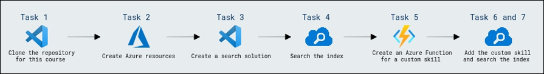

## Task 1: Clone the repository for this course

If you have already cloned **AI-102-AIEngineer** code repository to the environment where you're working on this lab, open it in Visual Studio Code; otherwise, follow these steps to clone it now.

1. Start Visual Studio Code.

1. Open the New Terminal and run a **Git: Clone** command to clone the `https://github.com/CloudLabs-MOC/AI-102-AIEngineer` repository to a local folder (it doesn't matter which folder).

1. Run the following command to clone the repository to a local folder.
   
   `git clone https://github.com/CloudLabs-MOC/AI-102-AIEngineer`.

   
   
1. When the repository has been cloned, open the folder in Visual Studio Code.

1. Wait while additional files are installed to support the C# code projects in the repo.

    > **Note**: If you are prompted to add required assets to build and debug, select **Not Now**.

## Task 2: Create Azure resources

> **Note**: If you have previously completed the **[Create an Azure AI Search solution](22-azure-search.md)** exercise, and still have these Azure resources in your subscription, you can skip this section and start at the **Create a search solution** section. Otherwise, follow the steps below to provision the required Azure resources.

1. In a web browser, open the Azure portal at `https://portal.azure.com`, and sign in using the Microsoft account associated with your Azure subscription.

1. View the **Resource groups** in your subscription.

1. If you are using a restricted subscription in which a resource group has been provided for you, select the resource group to view its properties. Otherwise, create a new resource group with a name of your choice, and go to it when it has been created.

1. On the **Overview** page for your resource group, note the **Subscription ID** and **Location**. You will need these values, along with the name of the resource group in subsequent steps.

    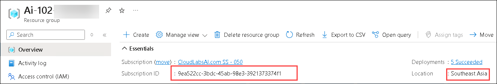 

1. In Visual Studio Code, expand the **23-custom-search-skill** folder and then select **setup.cmd**. You will use this batch script to run the Azure command line interface (CLI) commands required to create the Azure resources you need.

1. Right click on the **23-custom-search-skill** folder and select **Open in Integrated Terminal**.
1. In the terminal pane, enter the following command to establish an authenticated connection to your Azure subscription.

    ```
    az login --output none
    ```

    A web browser tab will open and prompt you to sign into Azure. Do so, and then close the browser tab and return to Visual Studio Code.

    - If prompted select **Work or school account** then click on **Continue**.

        

    - Enter the Email address and Password provided in the **Environment** tab.

    - Click on **No, sign in to this app only** to **Stay signed in ti all your apps**.

1. Navigate back to the VS code, If prompted **Select a subscription and tenant (Type a number or Enter for no changes):** press **Enter**.     

1. Run the following command to list Azure locations.

    ```
    az account list-locations -o table
    ```

1. In the output, find the **Name** value that corresponds with the location of your resource group (for example, for *East US* the corresponding name is *eastus*).

    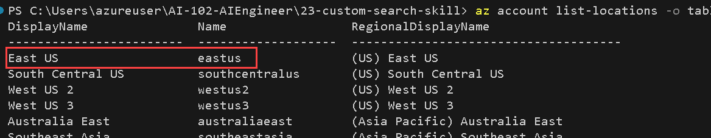 

1. In the **setup.cmd** script, modify the **subscription_id**, **resource_group**, and **location** variable declarations with the appropriate values for your subscription ID, resource group name, and location name. Then save your changes.

    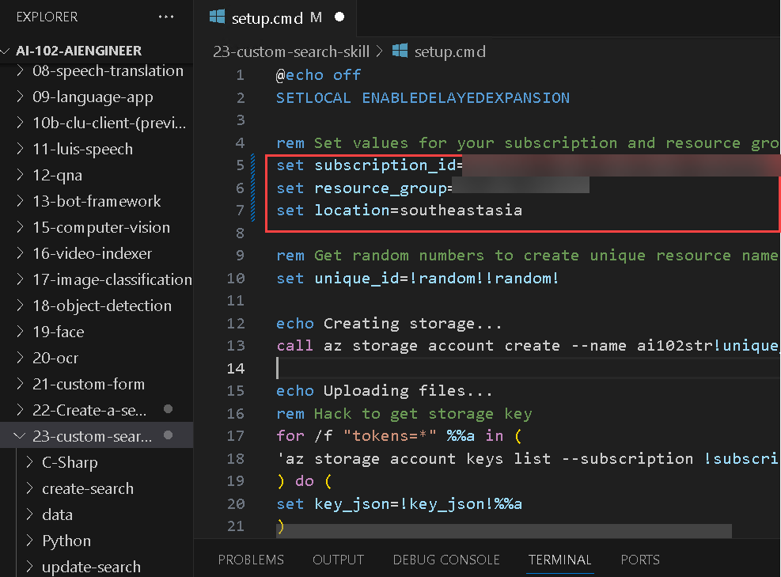 

1. In the terminal for the **23-custom-search-skill** folder, enter the following command to run the script:

    ```
    .\setup.cmd
    ```

    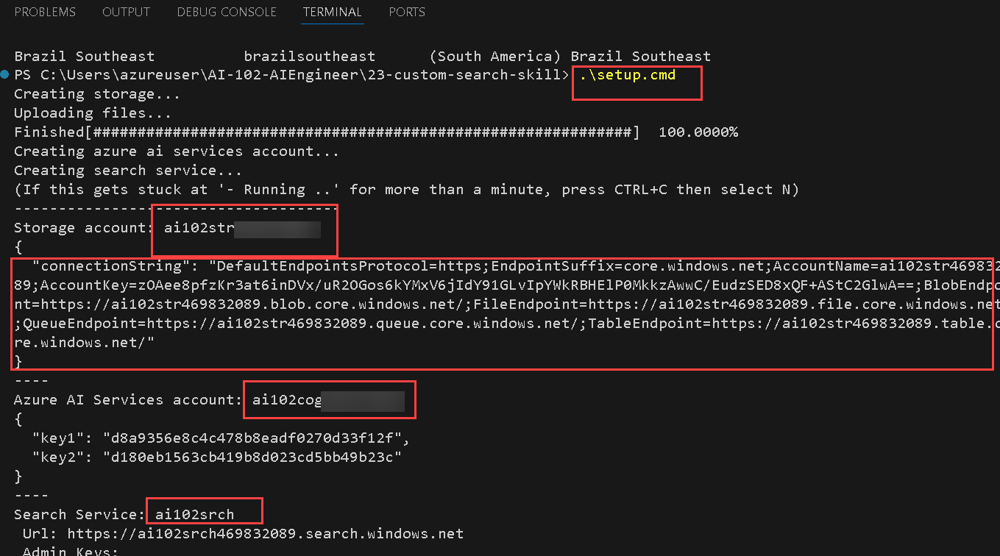     

    > **Note**: The Search CLI module is in preview, and may get stuck in the *- Running ..* process. If this happens for over 2 minutes, press CTRL+C to cancel the long-running operation, and then select **N** when asked if you want to terminate the script. It should then complete successfully.
    >
    > If the script fails, ensure you saved it with the correct variable names and try again.

1. When the script completes, review the output it displays and note the following information about your Azure resources (you will need these values later):
    - Storage account name
    - Storage connection string
    - Azure AI Services account
    - Azure AI Services key
    - Search service endpoint
    - Search service admin key
    - Search service query key

1. In the Azure portal, refresh the resource group and verify that it contains the Azure Storage account, Azure AI Services resource, and Azure AI Search resource.

    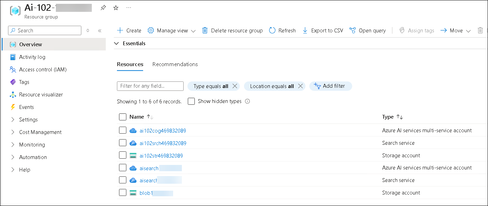 

## Task 3: Create a search solution

Now that you have the necessary Azure resources, you can create a search solution that consists of the following components:

- A **data source** that references the documents in your Azure storage container.
- A **skillset** that defines an enrichment pipeline of skills to extract AI-generated fields from the documents.
- An **index** that defines a searchable set of document records.
- An **indexer** that extracts the documents from the data source, applies the skillset, and populates the index.

In this exercise, you'll use the Azure AI Search REST interface to create these components by submitting JSON requests.

1. In Visual Studio Code, in the **23-custom-search-skill** folder, expand the **create-search** folder and select **data_source.json**. This file contains a JSON definition for a data source named **margies-custom-data**.

1. Replace the **YOUR_CONNECTION_STRING** placeholder with the connection string for your Azure storage account, which should resemble the following:

    ```
    DefaultEndpointsProtocol=https;AccountName=ai102str123;AccountKey=12345abcdefg...==;EndpointSuffix=core.windows.net
    ```

    *You can find the connection string on the **Access keys** page for your storage account in the Azure portal.*

    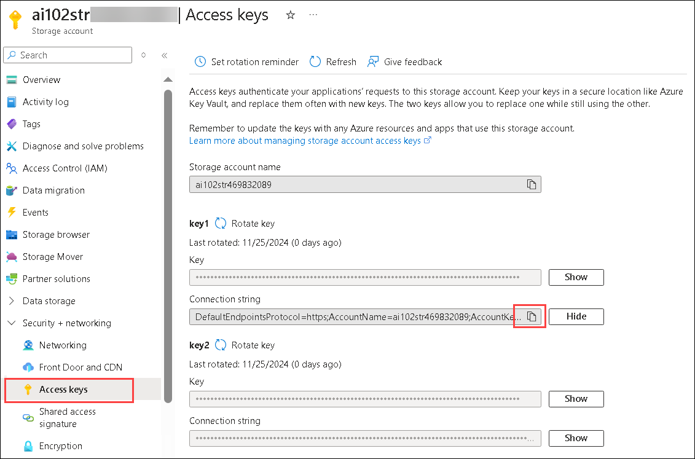     

1. Save and close the updated JSON file.

1. In the **create-search** folder, open **skillset.json**. This file contains a JSON definition for a skillset named **margies-custom-skillset**.

1. At the top of the skillset definition, in the **cognitiveServices** element, replace the **YOUR_AI_SERVICES_KEY** placeholder with either of the keys for your Azure AI Services resources.

    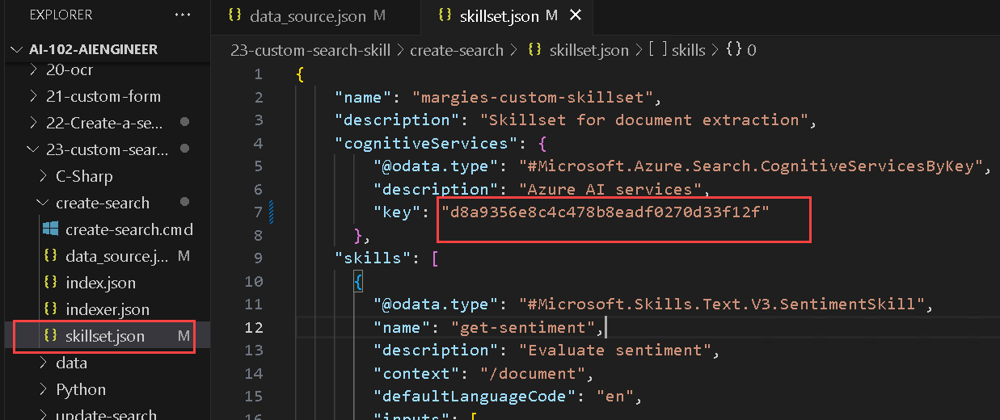 

    *You can find the keys on the **Keys and Endpoint** page for your Azure AI Services resource in the Azure portal.*

    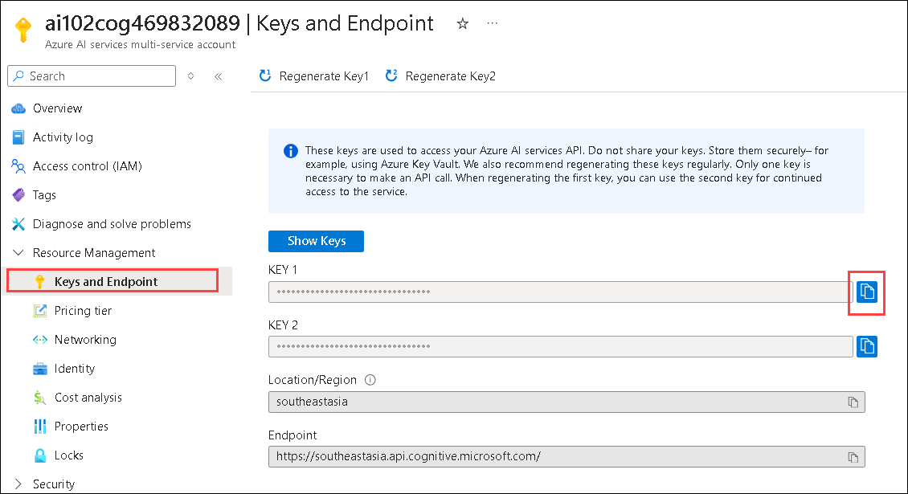     

1. Save and close the updated JSON file.

1. In the **create-search** folder, open **index.json**. This file contains a JSON definition for an index named **margies-custom-index**.

1. Review the JSON for the index, then close the file without making any changes.

1. In the **create-search** folder, open **indexer.json**. This file contains a JSON definition for an indexer named **margies-custom-indexer**.

1. Review the JSON for the indexer, then close the file without making any changes.

1. In the **create-search** folder, open **create-search.cmd**. This batch script uses the cURL utility to submit the JSON definitions to the REST interface for your Azure AI Search resource.

1. Replace the **YOUR_SEARCH_URL** and **YOUR_ADMIN_KEY** variable placeholders with the **Url** and one of the **admin keys** for your Azure AI Search resource.

    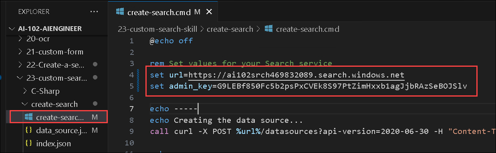 

    *You can find these values on the **Overview** and **Keys** pages for your Azure AI Search resource in the Azure portal.*

1. Save the updated batch file.

1. Right-click the the **create-search** folder and select **Open in Integrated Terminal**.

1. In the terminal pane for the **create-search** folder, enter the following command run the batch script.

    ```
    .\create-search.cmd
    ```

1. When the script completes, in the Azure portal, on the page for your Azure AI Search resource, select the **Indexers** page and wait for the indexing process to complete.

    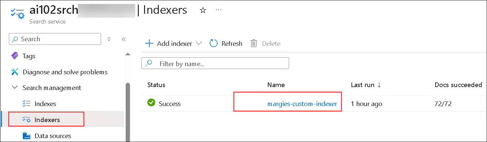 

    *You can select **Refresh** to track the progress of the indexing operation. It may take a minute or so to complete.*

## Task 4: Search the index

Now that you have an index, you can search it.

1. At the top of the blade for your Azure AI Search resource, select **Search explorer**.

1. In Search explorer, in the **Query string** box, enter the following query string, and then select **Search**.

    ```
    search=London&$select=url,sentiment,keyphrases&$filter=metadata_author eq 'Reviewer' and sentiment eq 'positive'
    ```

    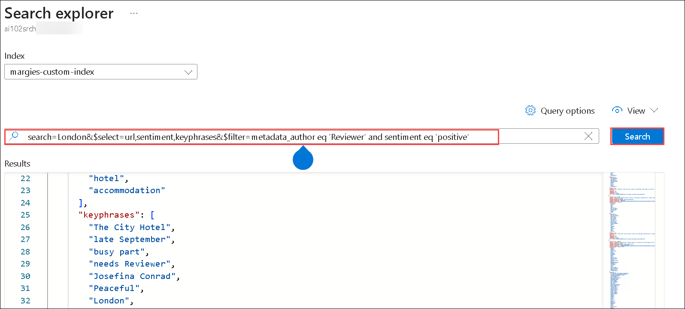     

    This query retrieves the **url**, **sentiment**, and **keyphrases** for all documents that mention *London* authored by *Reviewer* that have a positive **sentiment** label (in other words, positive reviews that mention London)

## Task 5: Create an Azure Function for a custom skill

The search solution includes a number of built-in AI skills that enrich the index with information from the documents, such as the sentiment scores and lists of key phrases seen in the previous task.

You can enhance the index further by creating custom skills. For example, it might be useful to identify the words that are used most frequently in each document, but no built-in skill offers this functionality.

To implement the word count functionality as a custom skill, you'll create an Azure Function in your preferred language.

> **Note**: In this exercise, you'll create a simple Node.JS function using the code editing capabilities in the Azure portal. In a production solution, you would typically use a development environment such as Visual Studio Code to create a function app in your preferred language (for example C#, Python, Node.JS, or Java) and publish it to Azure as part of a DevOps process.

1. In the Azure Portal, on the **Home** page, search for **Function App** and select **Function App** from the services.

    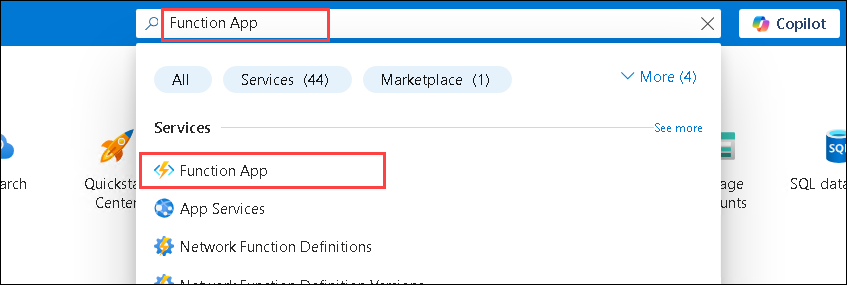 

1. Click on **+Create**.

    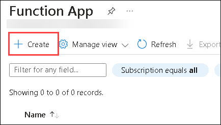 

1. Select **Cunsumption (1)** and then click on **Select (2)**.

    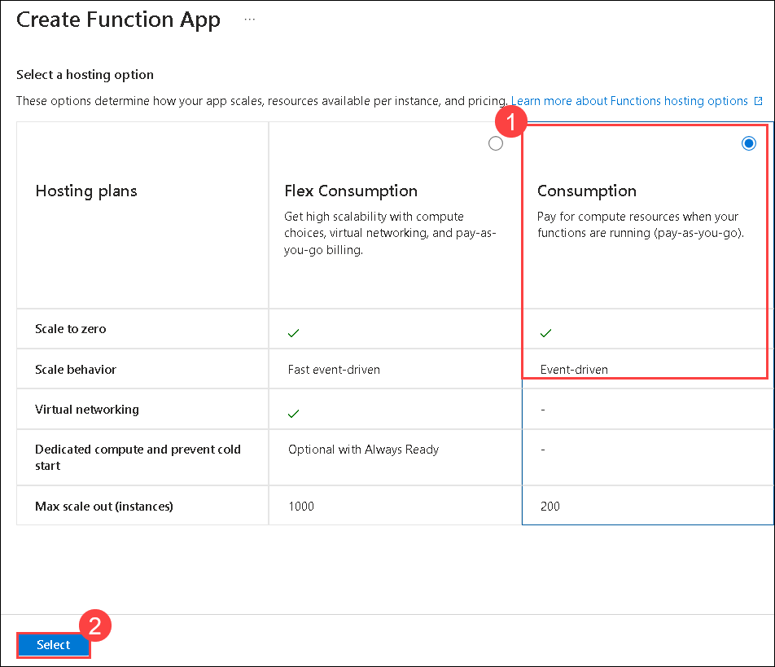 

1. Create a new **Function App** resource with the following settings:

    - **Subscription**: **Leave your default subscription (1)**

    - **Resource Group**: **ai-102-<inject key="DeploymentID" enableCopy="false"/> (2)**

    - **Function App name**: **aifunc<inject key="DeploymentID" enableCopy="false"/> (3)**

    - **Runtime stack**: **Node.js (4)**

    - **Version**: **18 LTS (5)**

    - **Region**: **<inject key="Region" enableCopy="false" /></inject> (6)** -*The same region as your Azure AI Search resource*

    - Click on **Review_Create (7)**

      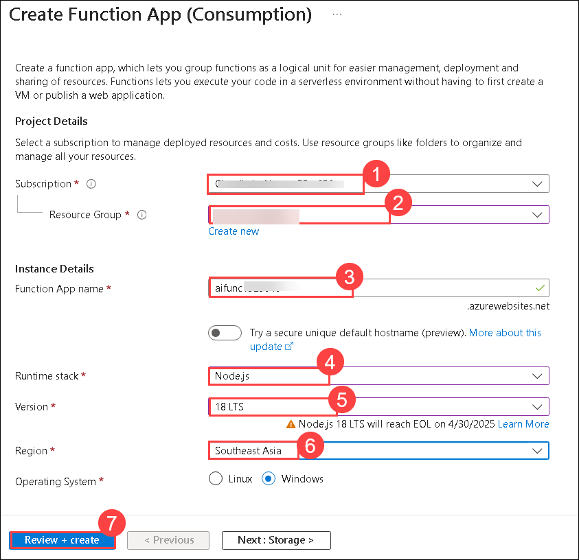     

1. Wait for deployment to complete, click on **Go to resources** and then go to the deployed Function App resource.

1. In the blade for your Function App, in the pane on the overview, select the **Functions** tab in the middle of the page. 

    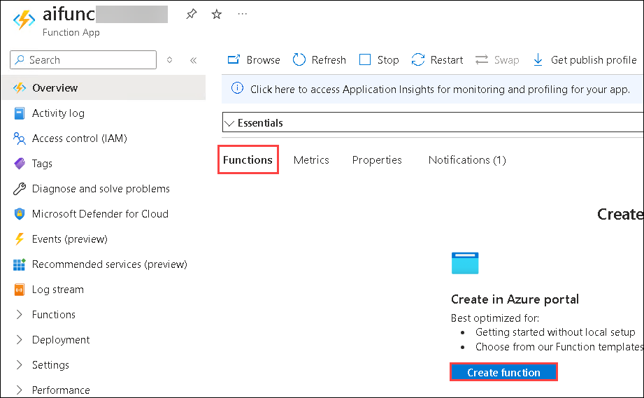 

1. Then create a new function with the following settings:

    - On **Select a template** page,
        - **Template**: **HTTP Trigger**, then click on **Next**.

          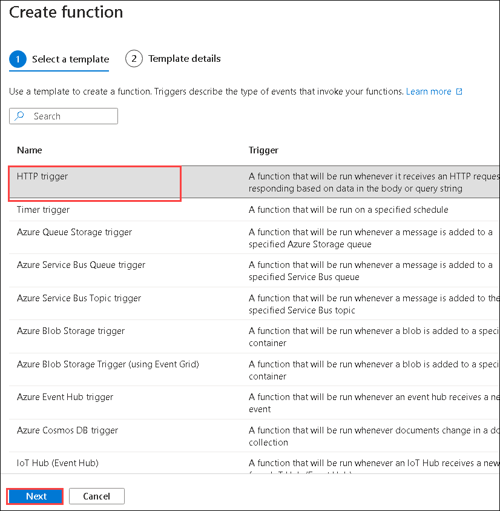         

    - On **Template details** page,    
        - **New Function**: **wordcount (1)**
        - **Authorization level**: **Function (2)**
        - Click on **Create (3)**

          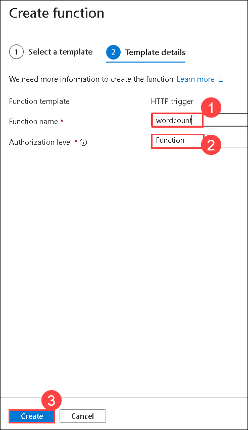 

1. Wait for the *wordcount* function to be created. Then in the **Function** tab, select the **wordcount** function.Then in its page, select the **Code + Test** tab.

1. Replace the default function code with the following code:

    ```javascript
    module.exports = async function (context, req) {
        context.log('JavaScript HTTP trigger function processed a request.');

        if (req.body && req.body.values) {

            vals = req.body.values;

            // Array of stop words to be ignored
            var stopwords = ['', 'i', 'me', 'my', 'myself', 'we', 'our', 'ours', 'ourselves', 'you', 
            "youre", "youve", "youll", "youd", 'your', 'yours', 'yourself', 
            'yourselves', 'he', 'him', 'his', 'himself', 'she', "shes", 'her', 
            'hers', 'herself', 'it', "its", 'itself', 'they', 'them', 
            'their', 'theirs', 'themselves', 'what', 'which', 'who', 'whom', 
            'this', 'that', "thatll", 'these', 'those', 'am', 'is', 'are', 'was',
            'were', 'be', 'been', 'being', 'have', 'has', 'had', 'having', 'do', 
            'does', 'did', 'doing', 'a', 'an', 'the', 'and', 'but', 'if', 'or', 
            'because', 'as', 'until', 'while', 'of', 'at', 'by', 'for', 'with', 
            'about', 'against', 'between', 'into', 'through', 'during', 'before', 
            'after', 'above', 'below', 'to', 'from', 'up', 'down', 'in', 'out', 
            'on', 'off', 'over', 'under', 'again', 'further', 'then', 'once', 'here', 
            'there', 'when', 'where', 'why', 'how', 'all', 'any', 'both', 'each', 
            'few', 'more', 'most', 'other', 'some', 'such', 'no', 'nor', 'not', 
            'only', 'own', 'same', 'so', 'than', 'too', 'very', 'can', 'will',
            'just', "dont", 'should', "shouldve", 'now', "arent", "couldnt", 
            "didnt", "doesnt", "hadnt", "hasnt", "havent", "isnt", "mightnt", "mustnt",
            "neednt", "shant", "shouldnt", "wasnt", "werent", "wont", "wouldnt"];

            res = {"values":[]};

            for (rec in vals)
            {
                // Get the record ID and text for this input
                resVal = {recordId:vals[rec].recordId, data:{}};
                txt = vals[rec].data.text;

                // remove punctuation and numerals
                txt = txt.replace(/[^ A-Za-z_]/g,"").toLowerCase();

                // Get an array of words
                words = txt.split(" ")

                // count instances of non-stopwords
                wordCounts = {}
                for(var i = 0; i < words.length; ++i) {
                    word = words[i];
                    if (stopwords.includes(word) == false )
                    {
                        if (wordCounts[word])
                        {
                            wordCounts[word] ++;
                        }
                        else
                        {
                            wordCounts[word] = 1;
                        }
                    }
                }

                // Convert wordcounts to an array
                var topWords = [];
                for (var word in wordCounts) {
                    topWords.push([word, wordCounts[word]]);
                }

                // Sort in descending order of count
                topWords.sort(function(a, b) {
                    return b[1] - a[1];
                });

                // Get the first ten words from the first array dimension
                resVal.data.text = topWords.slice(0,9)
                .map(function(value,index) { return value[0]; });

                res.values[rec] = resVal;
            };

            context.res = {
                body: JSON.stringify(res),
                headers: {
                'Content-Type': 'application/json'
            }

            };
        }
        else {
            context.res = {
                status: 400,
                body: {"errors":[{"message": "Invalid input"}]},
                headers: {
                'Content-Type': 'application/json'
            }

            };
        }
    };
    ```

1. Save the function.

    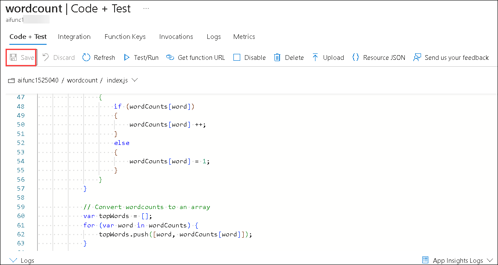 

1. Open the **Test/Run** pane.

1. In the **Test/Run (1)** pane, replace the existing **Body** with the following JSON **(2)**, which reflects the schema expected by an Azure AI Search skill in which records containing data for one or more documents are submitted for processing and then click on **Run (3)**.

    ```
    {
        "values": [
            {
                "recordId": "a1",
                "data":
                {
                "text":  "Tiger, tiger burning bright in the darkness of the night.",
                "language": "en"
                }
            },
            {
                "recordId": "a2",
                "data":
                {
                "text":  "The rain in spain stays mainly in the plains! That's where you'll find the rain!",
                "language": "en"
                }
            }
        ]
    }
    ```

    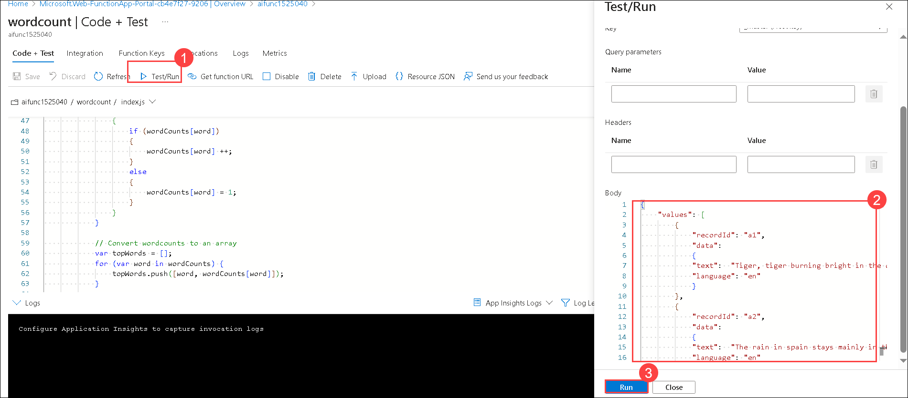     
    
1. View the HTTP response content that is returned by your function. This reflects the schema expected by Azure AI Search when consuming a skill, in which a response for each document is returned. In this case, the response consists of up to 10 terms in each document in descending order of how frequently they appear:

    ```
    {
    "values": [
        {
        "recordId": "a1",
        "data": {
            "text": [
            "tiger",
            "burning",
            "bright",
            "darkness",
            "night"
            ]
        },
        "errors": null,
        "warnings": null
        },
        {
        "recordId": "a2",
        "data": {
            "text": [
            "rain",
            "spain",
            "stays",
            "mainly",
            "plains",
            "thats",
            "youll",
            "find"
            ]
        }
        }
    ]
    }
    ```

    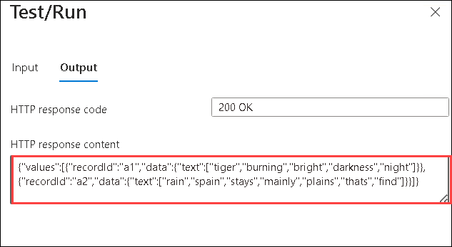     

1. Close the **Test/Run** pane and in the **wordcount** function blade, click **Get function URL (1)**. Then copy the URL for the default key to the clipboard. You'll need this in the next procedure.

   >**Note:** Please use the Detault **Function Key (2)** option.

    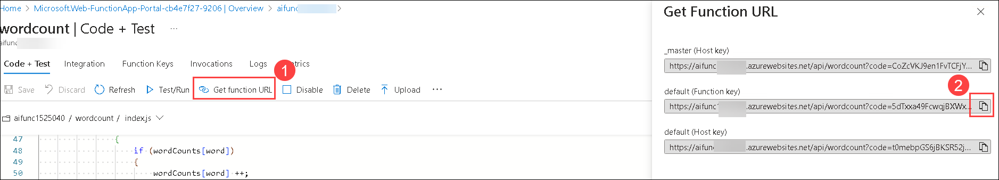    

## Task 6: Add the custom skill to the search solution

Now you need to include your function as a custom skill in the search solution skillset, and map the results it produces to a field in the index. 

1. In Visual Studio Code, in the **23-custom-search-skill/update-search** folder, open the **update-skillset.json** file. This contains the JSON definition of a skillset.

1. Review the skillset definition. It includes the same skills as before, as well as a new **WebApiSkill** skill named **get-top-words**.

1. Edit the **get-top-words** skill definition to set the **uri** value to the URL for your Azure function (which you copied to the clipboard in the previous procedure), replacing **YOUR-FUNCTION-APP-URL (1)**.

1. At the top of the skillset definition, in the **cognitiveServices** element, replace the **YOUR_AI_SERVICES_KEY (2)** placeholder with either of the keys for your Azure AI Services resources.

    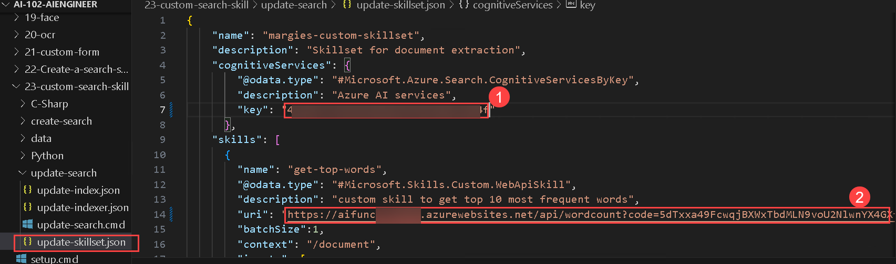 

    *You can find the keys on the **Keys and Endpoint** page for your Azure AI Services resource in the Azure portal.*

1. Save and close the updated JSON file.

1. In the **update-search** folder, open **update-index.json**. This file contains the JSON definition for the **margies-custom-index** index, with an additional field named **top_words** at the bottom of the index definition.

1. Review the JSON for the index, then close the file without making any changes.

1. In the **update-search** folder, open **update-indexer.json**. This file contains a JSON definition for the **margies-custom-indexer**, with an additional mapping for the **top_words** field.

1. Review the JSON for the indexer, then close the file without making any changes.
10. In the **update-search** folder, open **update-search.cmd**. This batch script uses the cURL utility to submit the updated JSON definitions to the REST interface for your Azure AI Search resource.

1. Replace the **YOUR_SEARCH_URL** and **YOUR_ADMIN_KEY** variable placeholders with the **Url** and one of the **admin keys** for your Azure AI Search resource.

    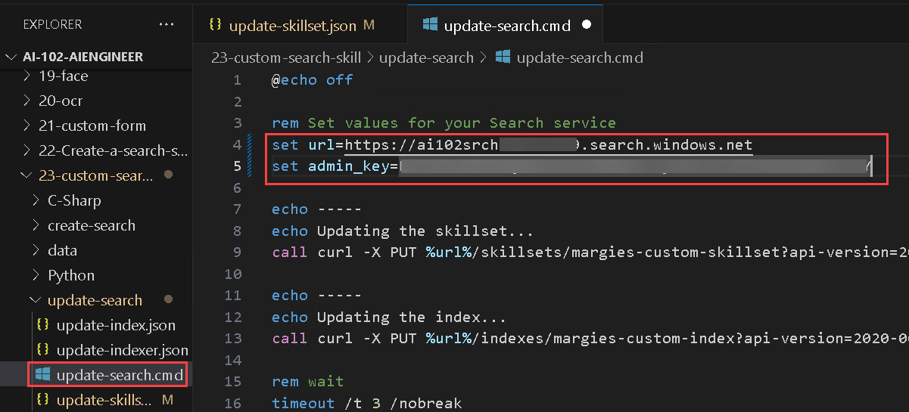 

    *You can find these values on the **Overview** and **Keys** pages for your Azure AI Search resource in the Azure portal.*

1. Save the updated batch file.

1. Right-click the the **update-search** folder and select **Open in Integrated Terminal**.

1. In the terminal pane for the **update-search** folder, enter the following command run the batch script.

    ```
    .\update-search.cmd
    ```

1. When the script completes, in the Azure portal, on the page for your Azure AI Search resource, select the **Indexers** page and wait for the indexing process to complete.

    *You can select **Refresh** to track the progress of the indexing operation. It may take a minute or so to complete.*

## Task 7: Search the index

Now that you have an index, you can search it.

1. At the top of the blade for your Azure AI Search resource, select **Search explorer**.

1. In Search explorer, change the view to **JSON view**, and then submit the following search query:

    ```json
    {
      "search": "Las Vegas",
      "select": "url,top_words"
    }
    ```

    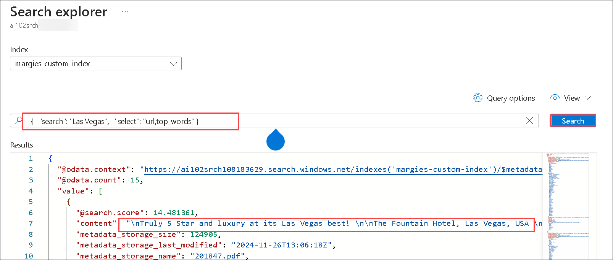 

    This query retrieves the **url** and **top_words** fields for all documents that mention *Las Vegas*.

> **Congratulations** on completing the task! Now, it's time to validate it. Here are the steps:
> - Hit the Validate button for the corresponding task. If you receive a success message, you can proceed to the next task. 
> - If not, carefully read the error message and retry the step, following the instructions in the lab guide.
> - If you need any assistance, please contact us at labs-support@spektrasystems.com. We are available 24/7 to help

<validation step="1fad44f5-db84-484f-b0d9-99d6c54793a6" />

### Review
In this lab, you have completed:

+ Cloned the repository for this course
+ Created Azure resources
+ Created a search solution
+ Searched the index
+ Created an Azure Function for a custom skill
+ Added the custom skill to the search solution
+ Searched the index

## You have successfully completed the lab, proceed with the next exercises.
